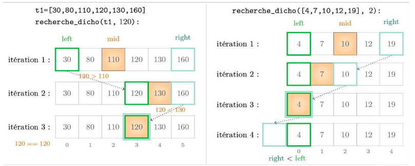
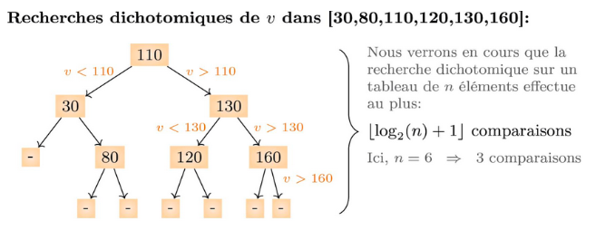

# Tris et recherches — Recherche dichotomique  


## Objectifs

Pour rechercher une valeur dans un tableau :

- lorsque celui-ci **n’est pas trié**, il n’existe pas de meilleur algorithme que la **recherche linéaire**, qui parcourt l’ensemble du tableau ;
- sur un tableau **trié**, on préfère utiliser un algorithme plus efficace : la **recherche dichotomique** (*binary search*).

Cette activité introduit la recherche dichotomique, puis compare son efficacité avec celle de la recherche linéaire.

👉 **Fichier Python de l’activité :**  
📥 [Télécharger `activite_dicho.py`](activite_dicho.py)


## Recherche dichotomique : le principe

Vous avez certainement déjà utilisé le principe de la recherche dichotomique dans la vie courante.

Par exemple, lorsque vous cherchez un mot dans un dictionnaire ou la page n° *x* d’un livre, vous ne parcourez pas toutes les pages : vous diminuez progressivement l’intervalle (le « pas ») de votre recherche jusqu’à trouver la page cherchée. De même, lorsque vous pesez un ingrédient sur une balance, vous affinez vos versements en approchant progressivement de la valeur désirée.

La recherche dichotomique (du grec *tomós* « coupure » et *díkha* « en deux ») applique cette idée d’affiner progressivement l’espace de recherche, en le divisant par deux jusqu’à trouver une valeur satisfaisante.

Pour cette activité, les fonctions de recherche retournent l’indice de l’élément recherché dans un tableau trié, ou `-1` s’il n’y est pas présent.


## Implémentation en Python (exemple)
```text
 1 def recherche_dichotomique(t, val):
 2     """entrée : tableau t trié par ordre croissant, valeur val
 3     résultat : indice i tel que t[i] == val, ou -1 si val not in t"""
 4
 5     idx_left = 0
 6     idx_right = len(t) - 1
 7
 8     while idx_left <= idx_right:
 9         idx_mid = (idx_left + idx_right) // 2
10
11         if t[idx_mid] == val:
12             return idx_mid
13         elif t[idx_mid] < val:
14             idx_left = idx_mid + 1
15         else:
16             idx_right = idx_mid - 1
17
18     return -1
```



## Comprendre le fonctionnement

Le principe de la recherche dichotomique est de maintenir un intervalle `[idx_left, idx_right]` qui contient l’indice recherché.

Considérons la recherche de la valeur `120` dans le tableau `t1 = [30, 80, 110, 120, 130, 160]`, comme illustré ci-dessus.

Au départ, l’intervalle correspond à tout le tableau : `idx_left = 0` et `idx_right = 5`. L’indice du milieu est alors `idx_mid = 2` et l’on compare `120` à `t[2] = 110`. Comme `120 > 110`, la valeur recherchée ne peut se trouver que dans la moitié droite du tableau : on met donc `idx_left = idx_mid + 1`.

Tant que la valeur n’est pas trouvée et que l’intervalle n’est pas vide, on continue à le diviser en deux. Ici, le nouvel indice du milieu correspond à `t[4] = 130`, qui est supérieur à `120` : on décale donc `idx_right` vers la gauche. Le milieu devient alors l’indice `3` et `t[3] = 120` : la valeur est trouvée, on renvoie l’indice `3`.

On peut représenter les comparaisons effectuées par la recherche dichotomique sous la forme d’un arbre, en fonction de la valeur recherchée.



La recherche dichotomique est généralement beaucoup plus rapide que la recherche linéaire sur un grand tableau, puisqu’à chaque itération elle élimine la moitié des cases restantes au prix d’une seule comparaison.


## Questions de compréhension

### 1. Nombre d’accès au tableau (pire cas)

Sur le tableau représenté ci-dessus, combien d’accès au tableau faut-il dans le **pire cas** pour trouver une valeur ou garantir son absence ?  
Répondre également pour des tableaux de taille 1, 2 et 3.

<details>
<summary><strong>Corrigé</strong></summary>

<br>

On considère le tableau : [30, 80, 110, 120, 130, 160]


Dans le pire cas :
- on compare d’abord avec `110`,
- puis avec `130`,
- puis avec `120` (ou on conclut que la valeur est absente).

👉 Il faut donc **au maximum 3 accès au tableau**.

Pour des tableaux plus petits :
- taille 1 : 1 accès ;
- taille 2 : au maximum 2 accès ;
- taille 3 : au maximum 2 accès.

</details>

---

### 2. Calcul de l’indice du milieu

Peut-on remplacer la division entière `//` par la division `/` pour calculer l’indice du milieu ?  
Que se passe-t-il si l’on utilise un arrondi supérieur ?

<details>
<summary><strong>Corrigé</strong></summary>

<br>

❌ On ne peut pas remplacer `//` par `/`.

Non, car les indices sont des entiers. Or `idx_left + idx_right` peut être pair ou impair. En utilisant la division euclidienne, on s'assure que `idx_mid` est entier. Par contre, on aurait tout aussi bien pu utiliser un arrondi supérieur. Pour s'en convaincre on pourrait raisonner que si on trie par ordre croissant le tableau avec les valeurs opposées (-160, -130...) alors la case sélectionnée comme milieu par la division euclidienne équivaut à l'arrondi supérieur sur le tableau de signe contraire.


</details>

---

### 3. Tableau non trié en entrée

Si l’on applique la recherche dichotomique à un tableau **non trié** :
- l’algorithme peut-il ne pas se terminer ?
- peut-on obtenir un résultat incorrect ?

<details>
<summary><strong>Corrigé</strong></summary>

<br>

Le code termine toujours et renvoie un indice ou -1 car le variant reste valide. Le code s'exécute bien sans lever de message d'erreur. Quand la valeur n'est pas présente, le code renvoie -1. Par contre, quand la valeur est présente dans le tableau il n'y a aucune garantie de trouver la valeur; il est tout à fait possible de renvoyer `-1`. Le résultat n'a donc pas de sens évident. En pratique on ne va donc jamais utiliser la recherche dichotomique sur un tableau non trié.

</details>


## Mesurer l’efficacité de la recherche dichotomique dans le pire cas

Le cours compare d’un point de vue théorique la complexité des algorithmes de recherche. Dans cette activité, on mesure **expérimentalement** le temps d’exécution à l’aide de la fonction `chrono` fournie dans le fichier Python (elle s’appuie sur la fonction `timeit.timeit`).

On admet que rechercher la valeur `n + 7` dans le tableau

```
[1, 2, ..., n]
```

correspond à un **pire cas** pour une entrée de taille `n`, aussi bien pour la recherche linéaire que pour la recherche dichotomique.

### Travail demandé

1. Comparer la durée d’exécution des recherches **linéaire** et **dichotomique** pour la valeur `1` (meilleur cas) et pour la valeur `10^6 + 7` (pire cas) dans le tableau `[1, 2, ..., 10^6]`.

<details>
<summary><strong>Corrigé</strong></summary>

<br>

On observe que la recherche dichotomique est un peu plus lente pour trouver le premier element du tableau, 
mais beaucoup plus rapide pour trouver le dernier, comme on peut s'y attendre.


</details>


2. Exécuter la fonction `affiche_pire_cas1` du fichier Python. Elle illustre la durée d’exécution des recherches linéaires et dichotomiques pour des tableaux de tailles n croissantes :
   `n = 10^5` puis  `n = 2 × 10^5` puis  `n = 3 × 10^5` puis … jusqu'à `n = 10^6`
   Les résultats obtenus sont-ils conformes aux complexités théoriques ?  
   Identifier un coefficient approximatif donnant le temps d’exécution du pire cas en fonction de `n` pour la recherche linéaire.

<details>
<summary><strong>Corrigé</strong></summary>

<br>


La recherche linéaire (pire cas) augmente bien à peu près proportionellement à la taille du tableau.
La durée de la recherche dichotomique est minime quelle que soit la taille du tableau, et très faible par rapport à la recherche linéaire.
Par contre, si la courbe est cohérente avec une courbe logarithmique, on ne peut pas le distinguer de manière aussi nette que la linéarite de la recherche linéaire:
d'une part car les valeurs sont négligeables par rapport aux durées de la recherche linéaire qui impose donc une échelle inadaptée sur l'axe vertical.
d'autre part on ne peut pas à l'oeil nu identifier de façon claire une courbe logarithmique, contrairement à une droite (ce serait possible en théorie sur une echelle semilogx puisque l'échelle semilogx ramène la courbe logarithmique à une droite).
enfin et surtout, même si on augmentait le nombre de répétitions et n'affichait que la courbe de la recherche dichotomique pour que l'échelle soit satisfaisante, on observerait probablement une courbe très irregulière.
Sur un ordinateur portable (CPU : i5 à 2,9 GHz, RAM : 16GB DDR3) :
la recherche linéaire demande approximativement (dans le pire cas) .7s sur un tableau de taille 1.000.000. Donc le temps d'exécution de la recherche linéaire sur un tableau de taille `n` dans le pire cas est à peu près de `n*7*10**-7` secondes sur cet ordinateur.
 Les valeurs obtenues sur un autre ordinateur peuvent varier, mais sont probablement du même ordre de grandeur.


</details>

