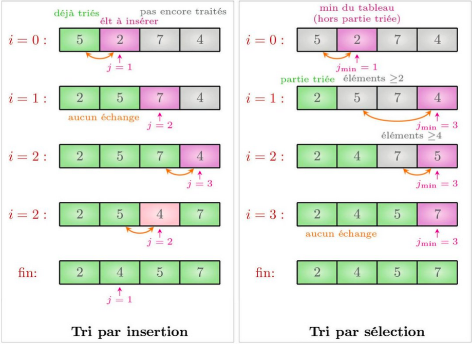
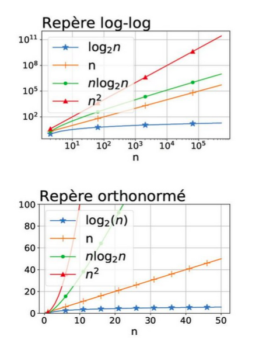

# 1. Pourquoi trier ?

La collecte de grandes quantités de données revêt aujourd’hui un intérêt stratégique, mais les données sont difficiles à exploiter lorsqu’elles ne sont pas organisées (imaginons une bibliothèque de livres en désordre complet). Trier, c’est-à-dire arranger les éléments selon un ordre prédéfini, est une opération très courante, que l’on utilise pour :

- présenter ou parcourir les données dans un ordre particulier soit pour faciliter leur lecture par un humain, soit pour fournir une représentation « canonique » lorsque l’on souhaite que des ensembles de données soient identifiés de façon identique quel que soit l’ordre dans lequel les données sont listées. Exemple : vérifier que deux produits ont les mêmes ingrédients ;
- regrouper ensemble des données identiques (dans cette application, une alternative au tri est l’utilisation d’un dictionnaire). Exemple : vérifier l’état alimentaire dans un ticket de caisse ;
- permettre de sélectionner plus rapidement les données pertinentes. Les recherches de rang (par exemple la sélection du maximum) sont immédiates sur un tableau trié, et les recherches de valeur sont plus efficaces grâce à la recherche dichotomique. Exemple : après avoir trié des dates de rendez-vous, trouver le premier rendez-vous après le 2 juin 2020.

---

# 2. Complexité des recherches linéaire et dichotomique

## 2.1. Prouver et analyser un algorithme

Lorsqu’un code contient une boucle non bornée (while), il est possible que le code boucle indéfiniment. On dit que le code termine lorsqu’il s’achève pour toute entrée valide et qu’il est correct s’il renvoie la valeur attendue pour toute entrée valide.

La complexité d’un algorithme est une estimation théorique de son temps d’exécution en fonction de la taille des données. Elle compte le nombre d’opérations « élémentaires » effectuées par l’algorithme sur l’entrée de taille n la plus défavorable. On se limite souvent à l’ordre de grandeur pour estimer la vitesse à laquelle l’algorithme croît.

On parle d’algorithme de complexité linéaire quand f(n) est de l’ordre de n (ex : 2n + 3, c'est plutôt affine en mathématiques), quadratique quand f(n) est de l’ordre de n² (ex : 5n² + 100n + 20n + 7 plutôt seconde degré en mathématiques), etc.

Dans les algorithmes de recherches dans un tableau, la taille de l’entrée est le nombre d’éléments du tableau, et les opérations que l’on compte plus spécifiquement sont les comparaisons, les échanges et les accès au tableau.

---

## 2.2. Recherche dans un tableau quelconque (non trié)

Nous allons prouver que l’algorithme de recherche suivant, qui parcourt l’ensemble du tableau, a une complexité linéaire (d’où son nom de recherche linéaire) et qu’il n’existe pas de meilleur algorithme sur un tableau non trié.

```python
def recherche_lin(t, val):
    """ renvoie l'indice i tel que t[i] == val, -1 s'il n'y en a pas """
    for i in range(len(t)):
        if t[i] == val:
            return i
    return -1
```
!!! note : "On utilise souvent le terme « tri » pour « algorithme de tri »."

---

### 2.2.1. Preuve de complexité linéaire
Le pire cas pour recherche_lin consiste en un tableau dans lequel l’élément val cherché se trouve en dernière position. Ex: recherche_lin([1,…,n],n). Les 
opérations effectuées par le programme recherche_lin dans le pire cas sont : 
 - n comparaisons des t[i] avec val 
 - n incréments du compteur i
 - le calcul de len(t). 

Sur toutes les entrées de taille n, l’algorithme fait au plus n comparaisons (et un nombre constant de fois n opérations), et il existe au moins une entrée où il 
en fait bien n. La complexité est donc linéaire en nombre de comparaisons, et aussi plus généralement toutes opérations comprises.

!!! note : "Le calcul de len(t) est une opération en temps constant en Python, car Python enregistre la taille de chaque tableau et n’a donc pas besoin de la calculer. La syntaxe par itération for x in t  permet aussi d’énumérer chaque élément du tableau en temps constant pour chaque itération. Le calcul de i in range s’effectue en incrémentant le compteur i à chaque étape."


### 2.2.2. Preuve d’optimalité

Prouvons formellement qu’il n’existe pas d’algorithme A plus efficace que la recherche linéaire sur un tableau quelconque. Soit t un tableau de taille n et val une valeur absente de t. Tant qu’il reste un indice j tel que A(val, t) n’a pas évalué t[j] (pour le comparer à val), A ne peut pas renvoyer −1 sans prendre le risque de se tromper. En effet A ne peut pas distinguer le tableau t du même tableau dans lequel on remplacerait t[j] par val. Donc A doit bien ans ce cas évaluer les n cases du tableau t avant de renvoyer un résultat.


## 2.3. Recherche dichotomique dans un tableau trié
 
Voici une implémentation en Python de la recherche dichotomique, présentée dans 
l’activité d’introduction : 
```python
def recherche_dichotomique(t, x):
    """ entrée : tableau t trié par ordre croissant, valeur x
        résultat : indice i tel que t[i] == x, ou -1 si x not in t """
    i_min = 0
    i_max = len(t) - 1
    while i_min <= i_max:
        mid = (i_min + i_max)//2
        if t[mid] == x:
            return mid
        elif t[mid] < x:
            i_min = mid + 1
        else:
            i_max = mid - 1
    return -1
```

## 2.4. Variant ou invariant de boucle pour prouver la terminaison ou la correction d'un programme

- Un invariant de boucle est une propriété qui est vraie au début et à la fin de chaque itération, donc en particulier vraie à l’entrée et à la sortie de la boucle. 
On prouve souvent la correction d’un programme en identifiant pour chaque boucle un invariant qui exprime l’idée 
principale de la boucle.

- Un variant de boucle est une valeur entière positive qui décroît à chaque passage dans la boucle. On 
prouve souvent la terminaison d’un programme en identifiant un variant pour chaque boucle.


---

# 3. Algorithmes pour trier un tableau
Les informaticiens ont inventé des dizaines d’algorithmes pour trier les tableaux, avec chacun leurs propriétés spécifiques: certains (comme le tri fusion qui sera vu en terminale) ont une bonne complexité dans le pire cas, d’autre offrent une bonne complexité en moyenne (comme le tri rapide), d’autres enfin sont plus simples et 
donc efficaces sur de petites données, mais inefficaces sur de grands tableaux. Les algorithmes de tri par insertion et tri par sélection que nous allons étudier rentrent dans cette dernière catégorie.
Les tris par sélection et par insertion sont des tris sur place : on modifie directement le tableau à trier en permutant des éléments, au lieu de créer un nouveau tableau pour stocker le résultat, ce qui économise de l’espace en mémoire. Ce sont aussi des tris par comparaison, comme la plupart des tris: l’emplacement d’une valeur est uniquement déterminé par descomparaisons entre valeurs du tableau. Ceci permet de les appliquer à tout type de donnée, et il suffit d’inverser les comparaisons pour trier par ordre décroissant : < devient >, <= devient >=, etc.
    
## 3.1. Tri par insertion


### 3.1.1. Principe et correction

<a href="https://www.youtube.com/watch?v=bRPHvWgc6YM" target="_blank" rel="noopener">
    Vidéo : le tri par insertion (YouTube)
</a>

À l’itération i, on insère l’élément d’indice i à sa place parmi les i premiers éléments du tableau (qui sont déjà triés). Pour cela, on part de l’élément i+1 et l’échange avec l’élément précédent jusqu’à ce qu’il atteigne sa position légitime.

L’algorithme de tri par insertion, implémenté ci-dessous en Python, maintient l’invariant suivant : à la fin de l’itération i, les i premières cases du tableau sont triées. Pour le prouver, on montre que la boucle `while` maintient l’invariant `t[j] <= t[j+1]`.

```python
def tri_insertion(t):
    for i in range(len(t)-1):
        j = i + 1
        while j > 0 and t[j] < t[j-1]:
            t[j-1], t[j] = t[j], t[j-1]
            j = j - 1
        # t[0] <= ... <= t[i+1] est trié
```
!!! note :"range(max, min, step) énumère les entiers max, max-step, max-2*step, ... jusqu’à min exclu.
Ainsi range(3, 0, -1) énumère 3, 2, 1.
On pourrait remplacer la boucle while par for j in range(i+1, 0, -1).
Le code serait plus court mais la complexité resterait quadratique, mais il est plus efficace d’arrêter la boucle dès que possible."
### 3.1.2. Complexité

Le nombre d’itérations de la boucle interne (ligne 4) est borné par i+1.
La valeur de i valant successivement 0, 1, ..., n−2 sur un tableau de taille n, la boucle interne (ligne 4) effectue successivement au plus 1 puis 2 puis … puis n−1 itérations au plus, et possiblement moins si t[i+1] trouve sa place rapidement.
Le nombre maximal d’itérations (donc de comparaisons, d’échanges et d’accès) est donc :
1 + 2 + ... + (n − 1) = n(n − 1)/2.
Dans le cas le plus défavorable (liste initialement triée par ordre décroissant), pour n = 4, le nombre d’échanges atteint bien 1 + 2 + 3 = 6.
Dans le meilleur cas (liste déjà triée), la complexité est linéaire puisque la boucle while s’interrompt immédiatement.

## 3.2. Tri par sélection

<a href="https://www.youtube.com/watch?v=8u3Yq-5DTN8" target="_blank" rel="noopener">
    Vidéo : le tri par sélection (YouTube)
</a>


### 3.2.1. Principe et correction

À l’itération i, on parcourt la partie droite du tableau à partir de l’indice i pour sélectionner son plus petit élément. On place alors cet élément à la position i du résultat en l’échangeant avec l’élément d’indice i. On commence ainsi par parcourir tout le tableau pour placer l’élément minimal en position 0, puis on parcourt les n−1 éléments restants pour trouver le second plus petit élément, etc.
L’algorithme de tri par sélection maintient l’invariant suivant : à l’itération i, les i premières cases de t contiennent les i plus petits éléments de t, triés, et l’ensemble des éléments contenus dans t ne varie pas : on contente de permuter ses éléments.

```python
def tri_selection(t):
    for i in range(len(t)-1):
        j_min = i
        for j in range(i+1, len(t)):
            if t[j] < t[j_min]:
                j_min = j
        if j_min != i:
            t[i], t[j_min] = t[j_min], t[i]
        # t[0] <= ... <= t[i] sont les plus petits éléments de t
```

### 3.2.2. Complexité
Sur un tableau de taille n, le nombre d’itérations de la boucle interne (ligne 5) vaut successivement n−1, n−2, ..., 0.
Le nombre total d’itérations est donc :
1 + 2 + ... + (n − 1) = n(n − 1)/2.
Dans le cas d’un tableau initialement trié par ordre décroissant (cas le plus défavorable pour cet algorithme), le nombre d’itérations atteint bien cette valeur. La complexité du tri par sélection est donc quadratique dans le pire des cas.
En revanche, ce tri n’effectue que n échanges dans le pire des cas.



!!! note :"Ces algorithmes sont généralement définis ainsi ; la fonction Python sort() est définie sur des tableaux Python. Il est toutefois possible de trier d’autres conteneurs de données.
Par contre, la recherche dichotomique n’a de sens que pour un tableau, ou une structure de données similaire avec accès par indice, comme les chaînes de caractères."


## 3.3. Méthodes de tri natives en Python
Python dispose de fonctions et méthodes natives pour trier les tableaux (implémentées par le type list en Python).
La fonction sorted() renvoie une liste triée à partir d’un tableau, alors que la méthode .sort() trie le tableau Python (même sur place). Trier un tableau Python ne modifie pas ses références, donc les copies de t ne sont pas affectées par le tri. L’option reverse=True permet de trier un tableau par ordre décroissant.

```python
t = [5, 0, 4, 2, 5, 6]
sorted(t)
sorted(t, reverse=True)
t.sort()
t.sort(reverse=True)
```

Ces fonctions ont une complexité optimale en n log n et permettent aussi de choisir le critère de tri. L’option key permet de spécifier une fonction à utiliser pour trier ; le rang d’un élément x n’est alors plus déterminé par la valeur x mais par f(x), comme illustré ci-dessous (ligne 7–9).

```python
def f(x):
    return x[0].lower()

sorted([('C','a'), ('a','B'), ('b','c')], key=f)
```


## 3.4. Un peu d’histoire
La première mention connue est la tablette babylonienne d’Ink-nihath-Anu, vers −200 av. J.-C., contenant 700 nombres et inverse en base 60.
Les premières machines à trier automatiques sont apparues à la fin du XIXᵉ siècle, pour calculer des statistiques sur un recensement aux États-Unis.
Lors de l’apparition des ordinateurs vers 1945, les algorithmes de tri font partie des tout premiers programmes informatiques et ils font aussi partie des premiers programmes dont on a analysé la complexité.
Dans les années 1960, les fabricants d’ordinateurs estimaient que 25 % du temps d’utilisation des ordinateurs était dédié à des opérations de tri. Depuis, les ordinateurs sont devenus beaucoup plus performants et ont évolué vers d’autres types d’applications, donc le coût de ces opérations est généralement faible pour les applications courantes, même si les tris restent une opération très fréquente. En utilisant un cluster de machines, il est actuellement possible de trier des dizaines de téraoctets de données en une minute.
La plupart des algorithmes de tri ont été inventés dans les années 1950–1960, mais c’est en 2002 qu’a été inventé Timsort, l’algorithme utilisé par Python, JavaScript, et Android.
Les figures ci-dessous montrent que n log n croît très lentement et que n² croît beaucoup plus vite que n → n log n.




# 4. Bilan

## 4.1 Familles d’algorithmes et exemples (avec tris)

Les 2 algorithmes étudiés dans ce chapitre ne sont pas les plus efficaces !

| Famille d’algorithmes        | Notation        | Exemples                                  |
|-----------------------------|-----------------|-------------------------------------------|
| Algorithmes constants       | Θ(1)            | Échanger deux valeurs                     |
| Algorithmes logarithmiques  | Θ(log n)        | Recherche binaire (dichotomique)          |
| Algorithmes linéaires       | Θ(n)            | Recherche séquentielle                    |
| Algorithmes quasi-linéaires | Θ(n log n)      | Tri fusion, tri rapide (en moyenne)       |
| Algorithmes quadratiques    | Θ(n²)           | Tri par sélection, tri par insertion      |

## 4.2 Effet sur le temps quand on double la taille de l’entrée

| Complexité | Nom courant        | Temps quand on double la taille de l’entrée | Exemple d’algorithme            |
|------------|--------------------|---------------------------------------------|---------------------------------|
| O(1)       | constant           | prend le même temps                          | accès à un élément              |
| O(log n)   | logarithmique      | prend une étape de plus                     | recherche dichotomique          |
| O(n)       | linéaire           | prend 2 fois plus de temps                  | recherche linéaire              |
| O(n log n) | quasi-linéaire     | un peu plus que 2 fois plus de temps        | tri fusion                      |
| O(n²)      | quadratique        | prend 4 fois plus de temps                  | tri par sélection, insertion   |

