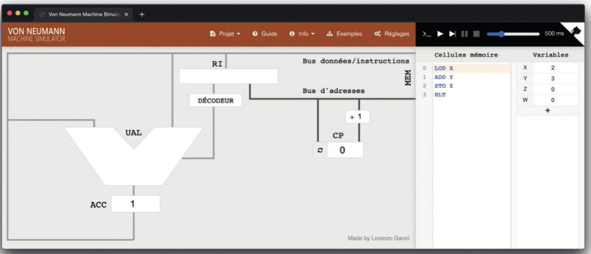
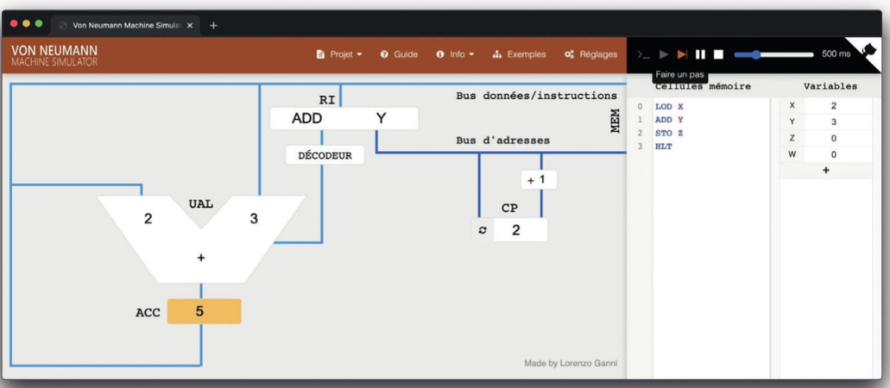
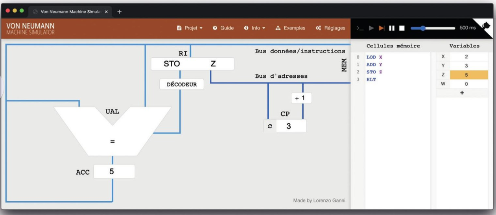
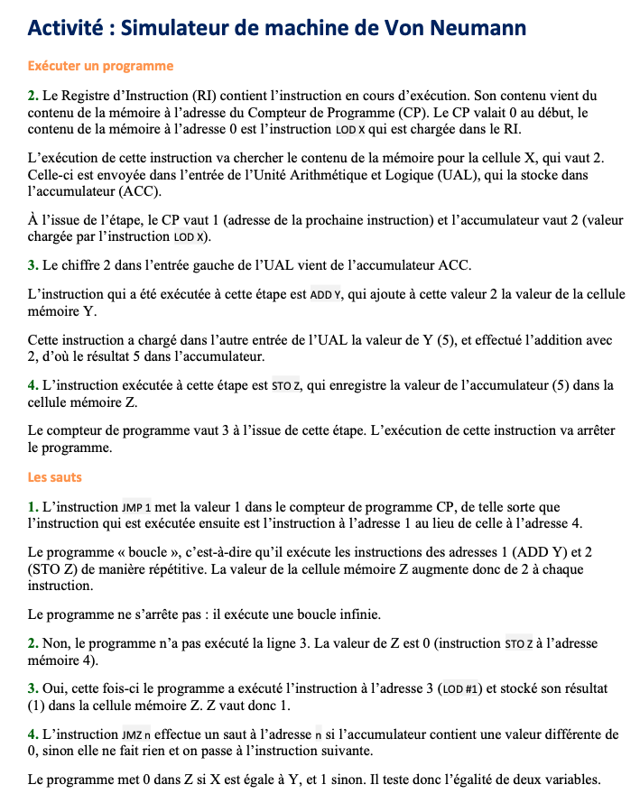

# 🧪 Activité : Machine de Von Neumann

---

## 🎯 Objectifs

Dans cette activité, nous utilisons un simulateur qui permet de comprendre le fonctionnement de la machine de Von Neumann. Cette machine comporte les éléments de base d’un ordinateur.

---

## 💻 Charger le simulateur

- Ouvrir <a href="https://apps.lyceum.fr/vnsim/">
📘 Machine VN
</a>

- Sélectionner et ouvrir le fichier **ADDITION** dans le menu *Exemples*  

L’écran devrait ressembler à l’image fournie.

---

## 🧠 Compréhension du système

À droite se trouve la mémoire :
- elle contient le programme  
- et quatre variables X, Y, Z et W  

À gauche se trouve le processeur :
- le Registre d’Instruction (RI) contient l’instruction en cours d’exécution  
- le Compteur de Programme (CP) contient le numéro de la prochaine instruction  
- l’Unité Arithmétique et Logique (UAL) effectue les calculs  
- l’Accumulateur (ACC) stocke les résultats intermédiaires  

---

## ▶️ Exécuter un programme

Le programme **ADDITION** est formé de quatre instructions :

- **LOD X** : charger la valeur de X dans l’accumulateur ACC  
- **ADD Y** : ajouter à l’accumulateur la valeur de Y  
- **STO Z** : stocker le contenu de l’accumulateur dans Z  
- **HLT** : s’arrêter (« halt »)  

---

### 🔍 Étapes

1. Faire glisser le curseur en haut à droite pour ralentir l’exécution, puis cliquer sur « Faire un pas »  
2. Observer :
   - le registre RI  
   - le compteur CP  
   - l’accumulateur ACC  

👉 Questions :
- D’où vient le contenu du registre RI ?  
- Pourquoi la valeur 2 est-elle dans l’entrée de l’UAL ?  
- Quelles sont les valeurs de CP et ACC après exécution ?  

---

3. Cliquer à nouveau sur « Faire un pas »

👉 Questions :
- D’où vient le chiffre 2 dans l’UAL ?  
- Pourquoi ACC affiche-t-il 5 ?  

---

4. Cliquer une troisième fois sur « Faire un pas »

👉 Questions :
- Pourquoi la variable Z vaut-elle 5 ?  
- Quelle est la valeur de CP à la fin ?  
- Que se passe-t-il si on clique encore ?  

---

## 🔁 Les sauts

Remplacer l’instruction **HLT** par **JMP 1** :

- Relancer le programme  
- Observer les valeurs de CP et Z  

👉 Questions :
1. Que fait l’instruction JMP 1 ? Le programme s’arrête-t-il ?  
2. Avec le programme **EQUAL**, le programme exécute-t-il la ligne 3 ? Quelle est la valeur de Z ?  
3. Modifier X = 3 puis relancer. Résultat ?  
4. Que fait l’instruction **JMZ** ?  

---

## 🧾 Conclusion

- Le processeur exécute les instructions **une par une**
- Le registre RI contient l’instruction active  
- Le compteur CP contrôle le déroulement du programme  
- Les instructions de saut permettent de **modifier le flux d’exécution**

## ✅ Correction

<b>Cliquer pour afficher la correction</b>

 

