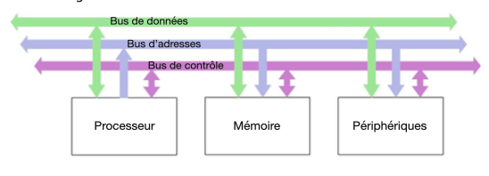
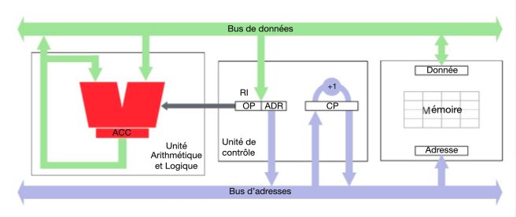
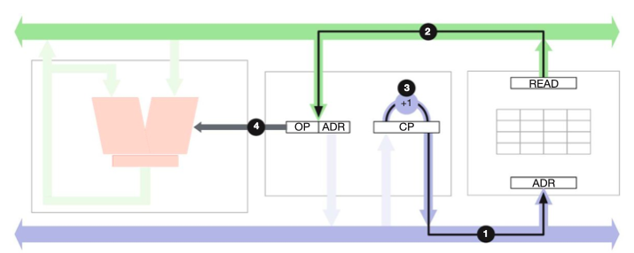
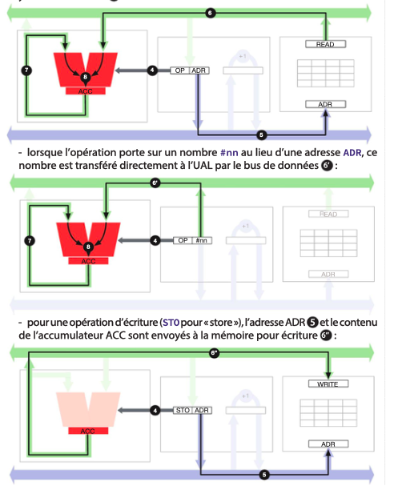
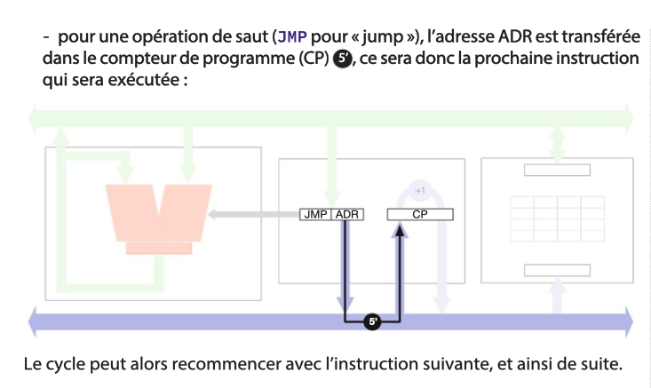
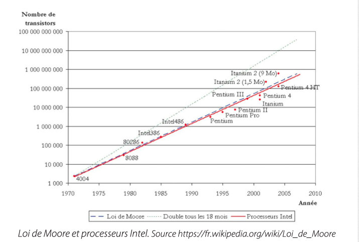
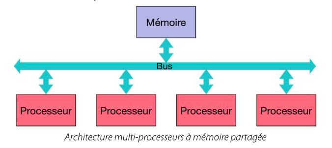
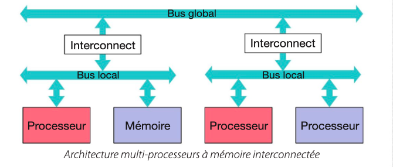

## 1. Architecture d’un ordinateur

Un ordinateur est une machine de traitement de l’information. L’information qu’il manipule est stockée dans la mémoire, et les traitements qu’il effectue sont réalisés par le processeur. Ces traitements sont également stockés dans la mémoire, sous forme de programme. C’est l’originalité de cette architecture qui est due à John von Neumann, qui lui a donné son nom. Un ordinateur a également un ou plusieurs périphériques pour communiquer avec l’extérieur tels que l’écran, le clavier, la mémoire de masse (disque dur) ou l’interface réseau (Internet).

Un ordinateur manipule de l’information codée sous forme binaire (chapitre 11), c’est-à-dire de bits qui valent 0 ou 1. Un octet est un « mot » constitué de 8 bits. On a l’habitude de caractériser la mémoire par sa capacité, en giga-octets (Go) ou même téra-octets (To), et la puissance du processeur par sa vitesse, en méga-Hertz (MHz) ou giga-Hertz (GHz), c’est-à-dire le nombre d’opérations effectuées par seconde.

La mémoire et le processeur communiquent par l’intermédiaire de 3 bus : le bus d’adresses permet au processeur d’indiquer à la mémoire l’emplacement qu’il souhaite accéder pour lire ou écrire une donnée ; le bus de données transporte les données du processeur vers la mémoire (écriture) ou de la mémoire vers le processeur (lecture) ; enfin le bus de contrôle permet de coordonner le fonctionnement du processeur et de la mémoire.

Le schéma général de l’architecture est le suivant :



---

## 2. La mémoire

Un ordinateur contient plusieurs types de mémoire parmi lesquelles : la mémoire vive (ou RAM pour « random access memory ») qui est la mémoire directement accédée par le processeur dans le schéma ci-dessus ; et la mémoire de masse qui consiste en un ou plusieurs disques durs et constitue l’un des périphériques de l’ordinateur.

La mémoire vive est beaucoup plus rapide mais beaucoup plus coûteuse que la mémoire de masse. C’est pourquoi un ordinateur personnel moderne contient quelques giga-octets de mémoire vive et plusieurs centaines de giga-octets de mémoire de masse. De plus le contenu de la mémoire vive disparaît lorsque l’on éteint l’ordinateur et doit donc être enregistré dans la mémoire de masse. Celle-ci stocke donc tous les documents et les programmes que l’on veut utiliser.

La mémoire est comme un grand parking dont les places sont numérotées : chaque emplacement mémoire a une adresse unique. Pour lire et écrire des données en mémoire, celle-ci a deux registres : le registre d’adresse et le registre de donnée. Pour lire la mémoire, on stocke l’adresse souhaitée dans le registre d’adresse, et on envoie un signal de lecture. La mémoire va chercher le contenu de cette adresse et le recopie dans le registre de donnée. Pour écrire dans la mémoire, on stocke l’adresse souhaitée dans le registre d’adresse et la valeur à stocker dans le registre de données et on envoie un signal d’écriture. Le contenu de l’emplacement mémoire visé est remplacé par la donnée fournie. Les signaux de lecture et d’écriture font partie du bus de contrôle.

### Le processeur

Le processeur est constitué d’une unité arithmétique et logique (UAL) et d’une unité de contrôle (UC).

Dans sa version la plus simple, l’UAL contient un registre appelé accumulateur (ACC) et peut effectuer des opérations simples : addition, soustraction, comparaison. Ces opérations sont effectuées entre la valeur actuelle de l’accumulateur et la valeur que l’UAL reçoit en entrée du bus de données. L’opération effectuée par l’UAL lui est communiquée par un code d’opération (OP) qui provient de l’unité de contrôle.

Un ordinateur est une machine programmable, c’est-à-dire que l’on peut définir, dans un programme stocké en mémoire, la séquence d’instructions qu’il doit effectuer. L’unité de contrôle est chargée d’obtenir les instructions successives du programme et de les exécuter. Pour cela, elle contient deux registres : le compteur de programme (CP), qui contient l’adresse en mémoire de la prochaine instruction à exécuter, et le registre d’instruction (RI), qui contient l’instruction en cours d’exécution. Cette instruction est constituée d’un code opération (OP) et d’un opérande qui est en général une adresse (ADR).

L’unité de contrôle contient aussi une horloge qui permet de séquencer ses actions. C’est la vitesse de cette horloge qui détermine la vitesse d’exécution du programme. Cette vitesse est limitée d’une part par la vitesse à laquelle les composants électroniques réagissent, d’autre part par leur consommation électrique.

---

## 3. Le cycle d’exécution

Le schéma ci-dessous montre l’ensemble de l’architecture de von Neumann (sans les périphériques et sans le bus de contrôle, pour simplifier) :



Le cycle d’exécution d’une instruction, qui est orchestré par l’unité de contrôle, est le suivant :

- l’adresse contenue dans le compteur de programme (CP) est envoyée à la mémoire ① pour récupérer dans le registre d’instruction (RI) l’instruction à exécuter ② ;
- le compteur de programme est incrémenté de 1 ③ pour être prêt à aller chercher la prochaine instruction au prochain cycle ;
- l’instruction est analysée et décomposée en un code opération (OP), envoyé à l’unité arithmétique et logique ④.



- Selon le code opération, plusieurs cas sont possibles :
  - pour une opération arithmétique ou logique (addition, soustraction, comparaison), l’adresse ADR est envoyée à la mémoire ⑤ et la donnée lue est envoyée à l’UAL ⑥, qui effectue l’opération OP avec le contenu de l’accumulateur ⑦ et y stocke le résultat ⑧.





## 4. Programmer en assembleur

Considérons le programme consistant à ajouter les nombres qui sont dans les adresses mémoires 100 et 101 et mettre le résultat à l’adresse 102.  
Il faut :
- charger le contenu de la mémoire à l’adresse 100 dans l’accumulateur ;
- ajouter le contenu de la mémoire à l’adresse 101 à l’accumulateur ;
- stocker le contenu de l’accumulateur à l’adresse 102.

Chacune de ces étapes correspond à une instruction du programme et est codée sous forme binaire. Pour que les instructions soient plus lisibles, on les représente par des codes mnémotechniques plutôt que par leur code numérique. Cette représentation symbolique est appelée langage d’assemblage ou assembleur.

Le jeu d’instructions de notre ordinateur est le suivant :

- Opérations arithmétiques et logiques :
  - ADD adr / ADD #nn : ajouter le contenu de l’adresse mémoire adr ou le nombre nn à l’accumulateur ;
  - SUB adr / SUB #nn : soustraire le contenu de l’adresse mémoire adr ou le nombre nn de l’accumulateur ;
  - CMP adr / CMP #nn : comparer le contenu de l’accumulateur avec le contenu de l’adresse mémoire adr ou le nombre nn et stocker −1, 0 ou 1 dans l’accumulateur selon le résultat (inférieur, égal ou supérieur).

- Accès mémoire :
  - LOAD adr / LOAD #nn : transférer le contenu de l’adresse mémoire adr ou le nombre nn dans l’accumulateur ;
  - STORE adr : transférer le contenu de l’accumulateur dans le contenu de l’adresse mémoire adr.

- Autre :
  - HALT : arrêter le programme.

  Le programme ci-dessus s’écrit alors ainsi dans cet assembleur :

```asm
0   LOAD 100   ; Lire la mémoire à l'adresse 100
1   ADD 101    ; Ajouter le contenu de la mémoire à l'adresse 101
2   STORE 102  ; Stocker le résultat à l'adresse mémoire 102
3   HALT       ; Fin du programme
```

## Sauts : Décisions et Boucles

Le jeu d’instructions ci-dessus est très limité car il permet seulement d’exécuter des séquences d’instructions. Pour effectuer des calculs plus sophistiqués, il faut pouvoir prendre des décisions en fonction des résultats antérieurs. Par exemple, si l’on veut calculer le minimum de deux valeurs, il faut non seulement les comparer, mais également effectuer un traitement différent selon le résultat. Si l’on veut effectuer des calculs répétitifs, par exemple calculer la somme des n premiers entiers, il faut pouvoir exécuter une même partie de programme plusieurs fois.

On introduit pour cela les sauts, qui sont des instructions qui modifient le compteur de programme.

- Saut inconditionnel :
  - JMP adr : mettre adr dans le compteur de programme CP.

- Sauts conditionnels :
  - JMPZ adr : mettre adr dans CP si le contenu de l’accumulateur est nul ;
  - JMPN adr : mettre adr dans CP si le contenu de l’accumulateur est négatif ;
  - JMPP adr : mettre adr dans CP si le contenu de l’accumulateur est positif.

Le saut inconditionnel JMP fait « sauter » le programme à une autre adresse, tandis que les sauts conditionnels testent le contenu de l’accumulateur pour décider si le programme continue à l’adresse suivante ou « saute » à l’adresse indiquée. Ainsi, JMPZ (« Jump if zero ») effectue un saut à l’adresse indiquée en opérande si le contenu de l’accumulateur est nul, sinon continue l’exécution du programme. De même JMPN et JMPP effectuent un saut si le contenu de l’accumulateur est négatif (JMPN) ou positif (JMPP), et continuent l’exécution à la suite sinon.

La combinaison des instructions de comparaison et des sauts est à la base de la puissance des ordinateurs : ils permettent d’effectuer des traitements répétitifs (les boucles) et de prendre des décisions en fonctions des résultats (les tests).

L’exemple ci-dessous stocke le plus grand des deux nombres X et Y (adresses 100 et 101) dans R (adresse 102) :

```asm
def X 100    ; définir X comme l'adresse 100
def Y 101    ; définir Y comme l'adresse 101
def R 102    ; définir R (résultat) comme l'adresse 102
LOAD X       ; Lire X
CMP Y        ; Comparer X à Y. Résultat = -1 si X < Y
JMPN neg     ; Aller à l'adresse 'neg' si X < Y
LOAD Y       ; Charger Y dans l'accumulateur
JMP suite    ; Aller à l'adresse 'suite'
neg: LOAD X  ; Charger X dans l'accumulateur
suite: STORE R ; Stocker le résultat dans R
HALT         ; fin du programme
```

Pour simplifier la lecture du programme, on a utilisé des définitions et des étiquettes : les définitions (def nom adr) permettent d’utiliser des noms au lieu d’adresses pour les opérations arithmétiques et logiques, et les étiquettes (etiq:) permettent d’utiliser des noms au lieu d’adresses pour les sauts. Lorsque l’on traduit le langage d’assemblage en code machine, ces noms sont remplacés par les adresses correspondantes dans la mémoire.

L’exemple ci-dessous calcule 2^N : N est stocké à l’adresse 100 et le résultat R à l’adresse 101. Il utilise une boucle c’est-à-dire un saut « en arrière », vers une partie de code déjà exécutée, qui sera donc exécutée plusieurs fois. À chaque tour de boucle, le programme multiplie la valeur de R par 2 et diminue N de 1. La boucle se termine lorsque N vaut 0, grâce au saut conditionnel JMPP.

Une boucle doit toujours contenir un test conditionnel qui permet de « sortir » de la boucle. Sinon le programme exécute la boucle indéfiniment et le programme ne s’arrête jamais (on dit qu’il « boucle »).

```asm
def N 100    ; définir N comme l'adresse 100
def R 101    ; définir R (résultat) comme l'adresse 101
LOAD #1      ; Charger 1 dans l'accumulateur
STORE R      ; Stocker cette valeur dans R
boucle: LOAD R ; Charger R dans l'accumulateur
MUL #2       ; Multiplier par 2
STORE R      ; Stocker le résultat dans R
LOAD N       ; Charger N dans l'accumulateur
SUB #1       ; Retirer 1 de l'accumulateur
STORE N      ; Stocker le résultat dans N
JMPP boucle  ; Boucler si N est positif
HALT         ; fin du programme
```

## 5. Entrées-Sorties

Pour avoir la moindre utilité, un ordinateur doit pouvoir communiquer avec son environnement : calculer ne sert à rien si le résultat du calcul reste à l’intérieur de l’ordinateur. Les données, comme les programmes, doivent être fournies à l’ordinateur depuis l’extérieur. Un ordinateur est donc muni d’organes d’entrée-sorties ou périphériques qui sont connectés à des dispositifs d’entrée tels que le clavier, la souris ou le capteur tactile d’un smartphone ou d’une tablette, et à des dispositifs de sortie tels qu’un écran et des haut-parleurs. Les dispositifs de stockage de masse comme les disques durs sont également des dispositifs d’entrée-sortie, de même que l’interface avec les réseaux de communication Ethernet, Wifi ou Bluetooth.

Il existe plusieurs méthodes pour que l’ordinateur interagisse avec les organes d’entrée-sortie. Dans l’architecture décrite ici, les périphériques sont connectés aux trois bus et se comportent comme une mémoire : on leur affecte des adresses qui ne correspondent pas à des adresses utilisées par la mémoire vive et on communique en lisant et en écrivant à ces adresses.

Par exemple, pour l’écran, qui est un périphérique de sortie, un ensemble d’adresses contiennent les valeurs de chaque pixel de l’écran. Pour les périphériques d’entrée, une adresse contient le code de la touche enfoncée sur le clavier (ou 0 si aucune touche n’est enfoncée), d’autres adresses contiennent les coordonnées de la position de la souris.

## Interruptions

Les périphériques d’entrée posent cependant un problème : comme le contenu de leur adresse change lorsque l’état du périphérique change, le programme doit constamment lire ces adresses pour détecter les changements, ce qui n’est pas efficace.

Un autre mode de fonctionnement, plus sophistiqué, utilise le bus de contrôle pour signaler à l’unité de contrôle qu’une donnée est disponible. On parle alors d’une interruption : lorsque l’unité de contrôle détecte cette information, elle « interrompt » son traitement normal en effectuant un saut vers un programme qui traite la donnée disponible. Lorsque le traitement est terminé, l’unité de contrôle reprend le programme qu’elle avait interrompu.

## 6. Architectures multi-processeurs

Des années 1970 aux années 2000, la miniaturisation des circuits a suivi la Loi de Moore qui prédit un doublement du nombre de transistors par cm² tous les 18 mois. Cette miniaturisation et l’augmentation des fréquences d’horloge (qui ont aussi doublé environ tous les 18 mois) ont permis d’augmenter la puissance des processeurs de façon exponentielle pendant près de 40 ans.



Mais depuis quelques années, l’augmentation de puissance repose sur des architectures multi-processeurs qui permettent à plusieurs processeurs de travailler simultanément (on parle aussi d’architecture parallèle). Ainsi la plupart des processeurs actuels sont multi-cœurs, c’est-à-dire qu’ils ont plusieurs unités centrales de contrôle, et une seule mémoire. Les processeurs graphiques (GPU pour « Graphics Processing Unit ») sont aussi utilisés pour décharger la charge du processeur « central » et prendre en charge l’affichage. Enfin, dans les centres de calcul et de données, comme ceux des grandes entreprises fournisseuses de services, des centaines, voire des milliers d’ordinateurs sont interconnectés pour se comporter comme un seul ordinateur géant.

Il existe deux grandes familles d’architectures multi-processeurs. L’architecture à mémoire partagée a une seule mémoire utilisée par tous les processeurs. Son inconvénient est qu’un seul processeur peut accéder à la mémoire à la fois, ce qui peut ralentir les autres processeurs.



L’architecture à mémoire interconnectée a une mémoire pour chaque processeur. Son inconvénient est qu’il faut recopier les données qui doivent être partagées entre les processeurs via un bus global et des modules d’interconnexion. Chaque architecture a donc ses avantages et inconvénients selon les caractéristiques du programme et la façon dont il tire parti de la parallélisation du calcul.



## 7. Les ordinateurs peuvent-ils tout calculer ?

Le principe de fonctionnement d’un ordinateur est simple, aussi peut-on se demander ce qu’il est possible de calculer – ou non – avec un ordinateur.

Bien avant le développement des ordinateurs modernes, les mathématiciens se sont posé la question de la calculabilité en termes mathématiques : existe-t-il des fonctions que l’on peut définir formellement mais dont on ne peut pas calculer certaines valeurs f(x) avec les opérations arithmétiques usuelles, même si x est dans son domaine de définition ?

Il s’avère qu’il existe des fonctions non calculables pour certaines valeurs, car il faudrait faire une infinité de calculs pour obtenir le résultat. Dans un ordinateur, cela se traduit par un programme dont l’exécution ne se termine jamais : on dit qu’il boucle. Malheureusement, il n’est pas possible de savoir si une fonction est calculable ou non : on dit que cette question est indécidable. De la même façon, il est impossible de savoir si un programme donné boucle ou non. Ces points seront développés dans le programme de terminale.

Cependant, on considère qu’un ordinateur est capable de calculer toute fonction qui est mathématiquement calculable, s’il a une mémoire suffisamment grande. Cela veut dire que l’on ne peut pas faire mieux qu’un ordinateur en termes de puissance intrinsèque de calcul. Tout ce que l’on peut faire est d’augmenter sa performance en le faisant calculer plus vite.

Ainsi, alors que les premiers ordinateurs pouvaient effectuer quelques milliers d’additions par seconde, les ordinateurs personnels actuels peuvent effectuer plusieurs milliards d’instructions par seconde et l’ordinateur le plus puissant du monde en 2021 est capable de réaliser plus de 400 millions de milliards (400.10¹⁵) opérations par seconde ! C’est là que réside la véritable puissance des ordinateurs.
