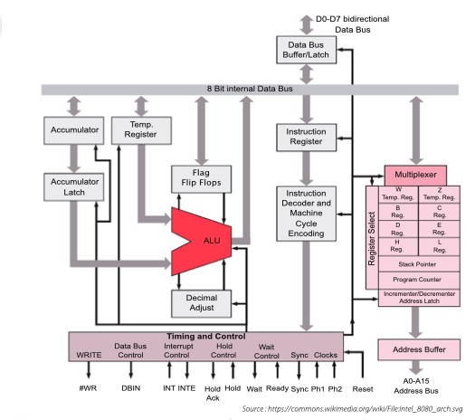

# 📝 Exercices – Architecture des ordinateurs

## 1. Cycle d’exécution
Mettre les actions du cycle d’exécution dans l’ordre.

1. L’adresse du code opération est envoyée à la mémoire  
2. Le code opération est envoyé à l’UAL  
3. Le compteur de programme est incrémenté  
4. Le contenu de la mémoire est envoyé à l’UAL  
5. Le contenu du compteur de programme est envoyé à la mémoire  
6. L’instruction est lue de la mémoire  
7. L’UAL effectue l’opération entre l’accumulateur et la donnée lue de la mémoire  

---

## 2. Registres
Pour chaque instruction ci-dessous, indiquer les registres qui sont affectés lors des phases ④ à ⑧ de son exécution.

- LOAD X  
- LOAD #1  
- ADD Y  
- MUL #2  
- STORE Z  
- JMP a  
- JMZ b  

---

## 3. Programme assembleur

On considère le programme en assembleur suivant :

```asm
LOAD X
SUB Z
STORE W
LOAD X
SUB Y
MUL #100
DIV W
STORE W
HALT
```

a. Exécuter le programme « à la main », sans l’aide du simulateur, avec les valeurs suivantes des adresses mémoire X, Y et Z : 10, 15, 20 ; 10, 20, 20 ; 10, 12, 20.  
b. Que fait le programme ?  
c. Vérifier à l’aide du simulateur en essayant d’autres valeurs.  

---

## 4. Boucle
Écrire le plus petit programme en assembleur qui boucle indéfiniment.

---

## 5. Échange
a. Écrire un programme en assembleur qui échange les valeurs des adresses X et Y, en utilisant l’adresse Z pour faire l’échange.  
b. Tester le programme sur le simulateur.  

---

## 6. Programme incomplet

On considère le programme en assembleur incomplet suivant :

```asm
LOAD X
DIV #2
MUL #2
CMP X
JMZ ??
??
JMP b
??
b: STORE Y
HALT
```

a. Compléter le programme pour qu’il mette 0 dans l’adresse mémoire Y si le contenu de l’adresse X est pair et 1 sinon.  
b. Vérifier avec le simulateur qu’il fonctionne correctement.  

---

## 7. Maximum
a. Écrire un programme en assembleur qui trouve le maximum de trois entiers aux adresses X, Y et Z et met sa valeur à l’adresse W.  
b. Tester le programme sur le simulateur.  

---

## 8. Architecture
Dessiner l’architecture d’un ordinateur comprenant un processeur avec quatre cœurs qui partagent une mémoire centrale et une carte graphique contenant un processeur GPU qui a sa propre mémoire.  

---

## 9. Performance
Un programme traite des données qui sont stockées en mémoire. La partie du programme qui traite chaque donnée est constituée de 100 instructions et l’horloge du processeur a une vitesse de 1 GHz. Combien de temps faut-il pour traiter un million de données ?  

---

## 10. Stockage
La mémoire de masse d’un ordinateur a une capacité de 500 giga-octets.

On considère les objets numériques suivants :
- un livre constitué de 300 pages, chaque page contenant 1500 caractères, chaque caractère étant représenté par un octet ;  
- une photo de taille 4000 x 3000 pixels, chaque pixel étant représenté par 4 octets ;  
- une vidéo de 5 minutes, qui nécessite 20 méga-octets par minute ;  
- un film de 2 h, au même format que la vidéo.  

a. Combien d’octets occupe chaque objet ?  
b. Combien de livres, d’images, de vidéos ou de films peut contenir la mémoire de masse ?  

---

## 11. Architecture Intel 8080




Le schéma ci-dessus représente l’architecture du micro-processeur Intel 8080, l’un des plus célèbres micro-processeurs à 8 bits, produit par Intel en 1974.

a. Identifier dans le schéma les composants vus en cours (unité arithmétique et logique, unité centrale, registres, bus).  
b. Est-ce que la mémoire apparaît dans ce diagramme ?  

---

## 12. Vitesse d’exécution

a. Le processeur Intel 8080 décrit ci-dessus avait une vitesse d’horloge de 2 MHz. L’exécution d’une instruction nécessitait entre 4 et 11 cycles d’horloge selon l’instruction. Quel est le nombre moyen d’instructions qu’il pouvait exécuter par seconde ?  

b. Le processeur ATMEL AVR est également un processeur 8 bits, qui est souvent utilisé actuellement dans les cartes Arduino. Il a une horloge de 20 MHz et toutes les instructions (à l’exception de la multiplication) s’exécutent en 1 cycle d’horloge. Combien de fois est-il plus rapide que l’Intel 8080 ?  

c. Le processeur A13 d’Apple, utilisé dans l’iPhone 11, peut exécuter jusqu’à mille milliards d’opérations par seconde. Combien faudrait-il de processeurs Intel 8080 fonctionnant en parallèle pour effectuer autant d’opérations par seconde ?  

---

## 13. Somme des n premiers nombres

a. Écrire un programme assembleur qui calcule la somme des n premiers nombres. n est stocké à l’adresse X et le résultat doit être stocké à l’adresse Z.  
b. Quel est le nombre d’instructions à exécuter en fonction de n ?


---

## 14. Programme mystère (1)

a. Dessiner l’organigramme du programme suivant.

```asm
LOAD X
a: SUB Y
JMPP a
JMPN b
LOAD #1
b: STORE Z
HALT
```

b. Sans utiliser le simulateur, exécuter le programme à la main pour les valeurs suivantes des adresses mémoire X et Y : 10 et 3, puis 10 et 2. Quelle est la valeur de Z dans chaque cas ?  
c. Que calcule le programme ?  
d. Confirmer votre réponse avec le simulateur en testant d’autres valeurs.  

---

## 15. Reste de la division entière

a. Écrire un programme en assembleur qui calcule le reste de la division du nombre à l’adresse X par celui à l’adresse Y, sans utiliser l’instruction de division entière. Le reste sera rangé à l’adresse Z.  
b. Modifier le programme de la question a. pour également calculer le quotient de la division, qui sera rangé à l’adresse W.  

---

## 16. Programme mystère (2)

a. Dessiner l’organigramme du programme suivant.

```asm
LOAD #1
STORE Z
a: LOAD Z
MUL X
STORE Z
LOAD Y
SUB #1
JMZ b
JMP a
b: HALT
```

b. Sans utiliser le simulateur, exécuter le programme à la main pour les valeurs suivantes des adresses mémoire X et Y : 2 et 8, puis 3 et 4. Quelle est la valeur de Z dans chaque cas ?  
c. Que calcule le programme ?  
d. Confirmer votre réponse avec le simulateur en testant d’autres valeurs.  

---

## 17. Clignotement

On suppose que l’adresse mémoire 1000 correspond à un périphérique de sortie qui est une simple LED. L’intensité de la LED est proportionnelle à la valeur stockée à cette adresse (0 = LED éteinte, 100 = LED à l’intensité maximale). On suppose par ailleurs que le processeur a une fréquence d’horloge d’1 MHz et qu’il exécute une instruction pour 5 cycles d’horloge.

a. Écrire un programme assembleur qui fait clignoter la LED de sorte qu’elle soit allumée pendant une seconde, puis éteinte pendant une seconde.  
b. Modifier le programme pour que les durées d’allumage et d’extinction soient stockées dans les adresses mémoire X et Y.  
c. Modifier le programme pour que la LED s’allume et s’éteigne progressivement.

Indication : On pourra tester le programme avec le simulateur en utilisant l’adresse mémoire W au lieu de l’adresse 1000, et observer les changements de valeur en exécutant le programme à la vitesse maximale.

---

## 18. Mémoire de masse

L’accès à la mémoire de masse est beaucoup plus lent que l’accès à la mémoire vive : 10 ms pour un disque mécanique ou 50 μs pour un disque dur de type SSD (« Solid-State Disk »), contre 10 ns pour la mémoire vive.

a. Combien d’accès à la mémoire vive peut effectuer le processeur pendant le temps d’un accès à un disque SSD ?  
b. Même question pour un disque dur mécanique.  

---

## 19. Technologie MOSFET

Le tableau suivant donne la taille minimale des composants de circuits électroniques créés avec la technologie MOSFET en fonction de l’année.

1971 : 10 μm  
1974 : 3 μm  
1977 : 6 μm  
1981 : 1.5 μm  
1984 : 1 μm  
1987 : 800 nm  
1990 : 600 nm  
1993 : 350 nm  
1996 : 250 nm  
1999 : 180 nm  
2001 : 130 nm  
2003 : 90 nm  
2005 : 65 nm  
2007 : 45 nm  
2009 : 32 nm  
2012 : 22 nm  
2014 : 14 nm  
2016 : 10 nm  
2018 : 7 nm  
2020 : 5 nm  

Tracer la courbe montrant la taille en fonction de l’année sur un graphe dont l’axe vertical est une échelle logarithmique (l’espace entre 1 et 10 nm est le même que l’espace entre 10 et 100 nm, 100 nm et 1 μm, etc.).

---

## 20. Programme mystère (3)

a. Dessiner l’organigramme du programme suivant.

```asm
LOAD #0
STORE Y
a: LOAD X
DIV #2
STORE X
JMZ b
LOAD Y
ADD #1
STORE Y
JMP a
b: HALT
```

b. Sans utiliser le simulateur, exécuter le programme à la main pour les valeurs suivantes de l’adresse mémoire X : 8, puis 15, puis 16. Quelle est la valeur de Y dans chaque cas ?  
c. Que calcule le programme ?  
d. Confirmer votre réponse avec le simulateur en testant d’autres valeurs.

