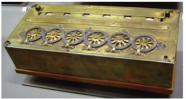
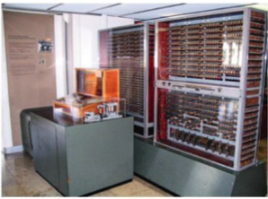
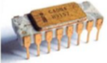
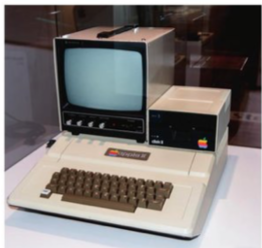
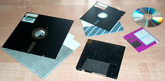

# 🖥️ Histoire des ordinateurs

---

## 📖 Introduction

L’ordinateur qui est dans notre poche – le smartphone – est plus puissant que ceux qui ont permis d’envoyer un être humain sur la lune il y a plus de cinquante ans. Pourtant, il fonctionne sur le même principe. Les prouesses qu’accomplissent les ordinateurs actuels, y compris celles que l’on regroupe sous le terme d’intelligence artificielle comme la reconnaissance vocale, la conduite d’un véhicule autonome ou la traduction automatique, reposent sur des circuits électroniques très « bêtes », mais extrêmement rapides. Ce chapitre décrit les principes de fonctionnement d’un ordinateur et évoque ses fondements mathématiques. Le reste de ce manuel présente les concepts et les outils – langages de programmation, algorithmes, interfaces utilisateur, systèmes d’exploitation, réseaux de communication – qui ont permis la révolution informatique.

---

## 🕰️ Frise historique

---

### 1. Avant les ordinateurs

- 2400 : Boulier  
- 1620 : Règle à calcul  
- 1642 : Pascaline (ci-contre)  
- 1804 : Métier à tisser de Jacquard  
- 1830 : Machine analytique de Babbage  
- 1890 : Mécanographie (Hollerith), traitement électromécanique de cartes perforées  

---

### 2. Les premiers ordinateurs

- 1936 : Article fondateur d’Alan Turing sur les fonctions calculables  
- 1941 : Z3 de Zuse – première machine électromécanique programmable (ci-contre)  
- 1943 : Colossus – premier ordinateur numérique programmable  
- 1945 : ENIAC – premier ordinateur « Turing-complet » (capable de calculer toute fonction calculable)  
- 1945 : Architecture de von Neumann  
- 1951-52 : EDVAC (successeur de l’ENIAC), IAS (conçu d’après l’article de von Neumann)  
- 1951 : Ferranti Mark I (UK) et Univac 1 (US) : premiers ordinateurs commerciaux  

---

### 3. Les ordinateurs modernes

- 1947 : Invention du transistor (le concept date de 1925)  
- 1953 : Premier ordinateur à transistors (Univ. Manchester)  
- 1958 : Premier circuit intégré (Fairchild), le concept date de 1952  
- 1965 : Loi de Moore, qui prédit le doublement de la capacité des circuits intégrés (grés à prix égal) tous les 18 mois  
- 1970 : Premiers micro-processeur sur une seule chip, dont le Intel 4004 (ci-dessus), utilisé pour la première fois dans la calculatrice Busicom  

---

### 4. Les premiers ordinateurs personnels

- 1972 : Micral N : premier ordinateur personnel vendu en kit  
- 1973 : Xerox Alto, à l’origine de l’avènement des interfaces graphiques  
- 1976 : Apple I, puis Apple II (ci-contre) en 1977  
- 1981 : IBM PC  
- 1984 : Apple Macintosh  

Une vidéo : 
<a href="https://www.lumni.fr/video/une-histoire-de-l-architecture-des-ordinateurs">
📘 Pour en savoir plus sur l'histoire de l'informatique ....
</a>

