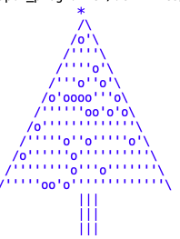

# Activité — Dessiner avec Python (ASCII Art)

## 🎯 Objectifs

Dans cette activité, nous allons apprendre à :

* utiliser des **boucles**
* manipuler des **chaînes de caractères**
* utiliser la **concaténation et la répétition**
* produire des dessins simples en **ASCII Art**

L’ASCII Art consiste à utiliser des caractères du clavier pour produire des images.

---

# A — Un carré en ASCII Art

Nous allons commencer par dessiner un **carré** à l’aide de la lettre `X`.

On peut construire une ligne avec une boucle :

```python
ligne = "[]"

for i in range(5):
    ligne = ligne + "-->8--"

print(ligne)
```

On peut aussi utiliser la **répétition des chaînes** :

```python
print("[]" + "-->8--" * 5)
```

---

## ✏️ Exercice 1

Écrire une fonction :

```python
carre(n)
```

qui affiche un carré de taille `n`.

Exemple pour `n = 8` :

```
X X X X X X X X
X             X
X             X
X             X
X             X
X             X
X             X
X X X X X X X X
```

!!! note
On affiche `X` plutôt que `XX` afin d'obtenir un carré visuellement plus équilibré.


---

# B — D'autres formes

Réutiliser la fonction précédente pour afficher les formes suivantes.

Le programme doit permettre de **modifier la taille du côté**.

---

## Croix dans un carré

```
X X X X X X X X 
X       X     X
X       X     X
X       X     X
X X X X X X X X              
X       X     X
X       X     X
X       X     X
X X X X X X X X 
```

---

## Diagonale descendante

```
X X X X X X X X X
X X             X
X   X           X
X     X         X
X       X       X
X         X     X
X           X   X
X             X X
X X X X X X X X X
```

---

## Origami

```
X X X X X X X X X X
X               X X
X             X   X
X           X     X
X         X       X
X       X X       X
X     X     X     X
X   X         X   X
X X             X X
X X X X X X X X X X
```

## Triangle

```


       X       
     X   X     
   X       X   
 X           X 
X X X X X X X X 


```

Triangle inversé 
```
X X X X X X X X X
X X X X   X X X X
X X X       X X X
X X           X X
X               X
X X X X X X X X X


```


# C — Le sapin de Noël

Nous allons maintenant dessiner un **sapin de Noël** en plusieurs étapes.

La fonction principale sera :

```python
sapin(n)
```

où `n` représente la taille du feuillage.

---

## Étape 1

Afficher un **triangle** représentant le feuillage.

Utiliser :

* `/` et `\` pour les côtés
* `|` pour le tronc
* `^` pour l’étoile

---

## Étape 2

Ajouter **l’étoile au sommet**.

---

## Étape 3

Ajouter une **texture au feuillage** en alternant :

```
' " ' " ' "
```

---

## Étape 4

Ajouter des **décorations aléatoires**.

La fonction `random()` permet de générer un nombre aléatoire entre 0 et 1.

```python
import random

if random.random() < 0.2:
    print("o")
```

Ainsi, une décoration apparaît **environ 20 % du temps**.



---

!!! warning
Pour afficher un **backslash `\`** dans une chaîne Python, il faut écrire `\\`.

````
Exemple :

```python
print("\\")
```

Certains caractères spéciaux utilisent aussi le backslash :

- `\n` → retour à la ligne  
- `\t` → tabulation
````

👉 **Fichier solution Python de l’activité :**  
📥 [Télécharger `activite_Ascii.py`](activite_ascii.py)

