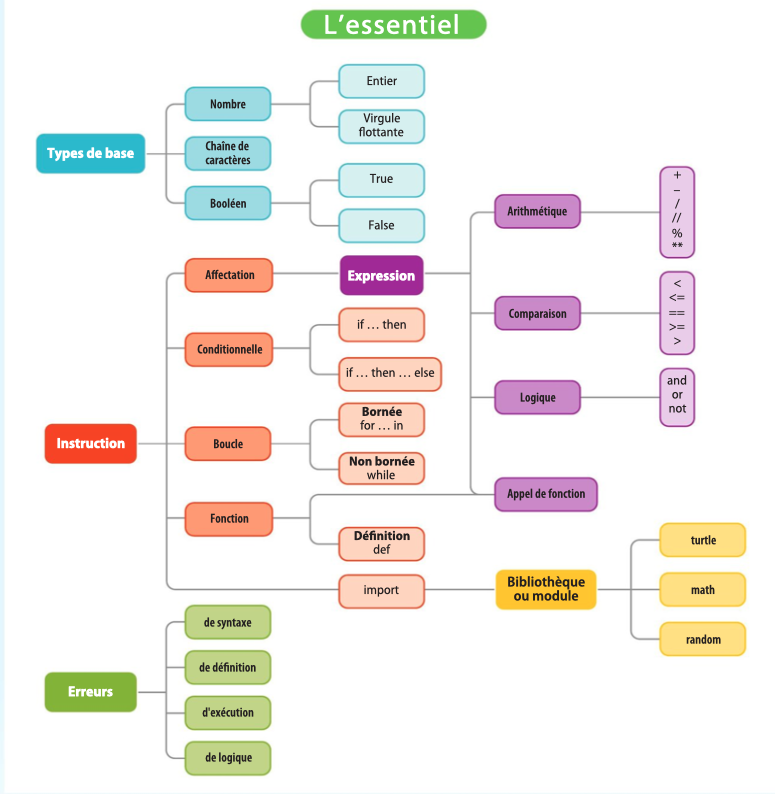

# cours

# 1. Types de base

Les langages de programmation permettent de manipuler des données de différents types.  
Un type définit l’ensemble des valeurs possibles pour les données qu’il admet.

On distingue les **types de base**, décrits dans ce chapitre, des types structurés décrits dans les chapitres suivants.

Les principaux types en **Python** sont :
- les nombres
- les textes (appelés chaînes de caractères)
- les booléens

---

## 1.1 Nombres

Python distingue :

- les **nombres entiers** (`int`)
- les **nombres à virgule flottante** (`float`)

Exemples d'entiers :

```text
5
-20
987654321
```

Les nombres à virgule flottante utilisent le **point** comme séparateur décimal :

```text
1.5
3.14159
-6.5
```

On peut omettre le 0 avant ou après le point :

```text
.5
5.
```

Notation scientifique avec `e` :

```text
5e3      # 5000
-123.4e-5
```

---

## 1.2 Chaînes de caractères

Les **chaînes de caractères** (`string`) sont des textes entre guillemets simples ou doubles.

```python
'Bonjour'
"Bonjour"
```

Cela permet d'utiliser l'autre type de guillemets dans le texte :

```python
"Il dit qu'il fait beau et s'en va."
'Il dit: "Il fait beau" et part.'
```

Les chaînes sont normalement sur **une seule ligne**.

Pour écrire un texte sur plusieurs lignes :

```python
"""Voici un texte
sur plusieurs lignes"""
```

---

## 1.3 Booléens

Les valeurs **booléennes** (`bool`) ne peuvent prendre que deux valeurs :

```text
True
False
```

Elles sont utilisées pour la prise de décision.

Exemple :

```python
2 < 3   # True
3 < 2   # False
```

---

# 2. Variables et affectation

Les données d’un programme sont rangées dans des **variables**.

Chaque variable Python a un **nom** qui doit :

- contenir lettres, chiffres ou `_`
- ne pas commencer par un chiffre
- ne pas contenir d'espace

Exemples de noms :

```text
taille
age
nombre_de_tours
```

Python distingue **majuscules et minuscules** :

```text
taille
Taille
TAILLE
```

sont trois variables différentes.

---

## Affectation d'une valeur

Pour stocker une valeur dans une variable :

```text
variable = valeur
```

Exemple :

```python
taille = 1.78
```

⚠️ Le signe `=` **n'est pas une égalité mathématique**, il signifie **affecter une valeur**.

Exemple :

```python
hauteur = taille
```

La variable `hauteur` reçoit la valeur de `taille`.

Programme :

```python
taille = 1.78
hauteur = taille
taille = 1.60
```

Résultat :

```text
hauteur = 1.78
taille = 1.60
```

---

# 3. Expressions

Une **expression** permet de calculer une valeur en combinant :

- des constantes
- des variables
- des fonctions
- des opérateurs

Exemples :

```text
taille
3 + 4
sin(x)
```

---

## 3.1 Opérateurs arithmétiques

Opérations principales :

| Opération | Symbole |
|-----------|--------|
| addition | `+` |
| soustraction | `-` |
| multiplication | `*` |
| division | `/` |
| puissance | `**` |

Exemples :

```python
3 + 4
3 * 4
2 ** 3
```

Division entière :

```python
7 // 2   # 3
```

Reste de division :

```python
7 % 2   # 1
```

Priorités :

1. `**`
2. `* / // %`
3. `+ -`

Les **parenthèses** permettent de changer l'ordre :

```python
(3 + 5) // 3 ** 4
```

---

## Fonctions mathématiques

On peut importer la bibliothèque `math` :

```python
from math import *
```

Exemple : calcul des racines d'un polynôme.

```python
delta = b**2 - 4*a*c
x1 = (-b + sqrt(delta))/(2*a)
x2 = (-b - sqrt(delta))/(2*a)
```

---

## 3.2 Opérateurs logiques

Les comparaisons donnent un résultat **booléen**.

Opérateurs :

```text
==
!=
<
>
<=
>=
```

Exemples :

```python
3 + 4 < 6
1 + 2 == 6 / 4
```

Combinaisons logiques :

```python
x < 0 or x > 100
x >= 0 and x <= 100
not majeur
```

---

## 3.3 Opérateurs sur les chaînes de caractères

Concaténation :

```python
'bon' + 'jour'   # 'bonjour'
```

Répétition :

```python
'ha' * 3   # 'hahaha'
```

Comparaison de chaînes :

```python
'bon' < 'jour'
'ha' == 'HA'
'ou' in 'jour'
'on' not in 'Bon'
```

Longueur d'une chaîne :

```python
len('toto')  # 4
```

---

## Priorité des opérateurs (logiques)

1. `or`
2. `and`
3. `not`
4. `in`, `not in`
5. `==`, `!=`, `<`, `<=`, `>`, `>=`
6. `+`, `-`
7. `*`, `/`, `//`, `%`
8. `**`

---

# 4. Instructions

Les instructions sont les briques de base d’un programme : un programme est une suite d’instructions.  
Nous avons déjà vu trois types d’instructions :
- Affectation : `variable = expression`, par exemple `a = b**2 - 4*a*c`
- Appel de fonction : `fonction(paramètres)`, par exemple `print("abc")` ou `forward(10)`
- Importation d’une bibliothèque : `from bibliothèque import *`, par exemple `from turtle import *`

Le langage Python a trois autres types d’instructions : les conditionnelles, les boucles et les définitions de fonctions.

## 4.1. Conditionnelles et blocs

La conditionnelle est une instruction qui permet d’exécuter du code selon qu’une condition est remplie ou non. Par exemple, pour faire reculer la tortue de 10 pas et la faire tourner à gauche de 20 degrés si une certaine variable `x` contient une valeur négative :

```python
if x < 0:
    backward(10)
    left(20)
```

L’instruction `if` est suivie d’une expression booléenne et du caractère `:`. Les instructions à exécuter si la condition est satisfaite sont *indentées*, c’est-à-dire qu’elles sont décalées par rapport au `if` en insérant des espaces. Une telle séquence d’instructions, toutes *indentées* du même nombre d’espaces, est appelée un bloc. C’est ainsi que le langage Python différencie la séquence d’instructions à effectuer quand la condition est remplie, par opposition à la suite du code qui sera exécutée dans tous les cas :

```python
if x < 0:
    backward(10)   # exécutée si x < 0
    left(20)       # exécutée si x < 0
forward(10)        # exécutée dans tous les cas
```

La conditionnelle peut aussi avoir une branche `else:` pour exécuter un bloc si la condition n’est pas remplie, c’est-à-dire si le résultat de l’expression qui suit `if` est **False**. Ici, la tortue recule de 10 et tourne à gauche si `x` est négatif, sinon elle avance de 10 pas.

```python
if x < 0:          # "si x est négatif..."
    backward(10)
    left(20)
else:              # "sinon, ..."
    forward(10)
```

Plusieurs tests peuvent être enchaînés grâce au mot-clé `elif`, abréviation de *else if*. Ici, la tortue tourne à gauche si `x` est négatif, elle tourne à droite si `x` est supérieur à 100, et elle avance de 10 dans les autres cas.

```python
if x < 0:          # "si x est négatif..."
    left(20)
elif x > 100:      # "sinon, si x > 100..."
    right(20)
else:              # "sinon, ..."
    forward(10)
```

Restez que l’on peut être amené à évaluer la véracité des conditions dès lors que l’une d’entre elles est **True** :

```python
if x < 0:
    print('négatif')
elif x < -100:
    print('très négatif')
```

Enfin, les conditionnelles peuvent être imbriquées :

```python
if x < 0:
    if x % 2 == 0:
        print('pair et négatif')
    else:
        print('impair et négatif')
else:
    print("pair, et c'est tout ce qui m'intéresse")
```

## 4.2. Boucles

Les boucles permettent de répéter des blocs d’instructions. Python propose deux types de boucles : les boucles bornées (`for`) et les boucles non bornées (`while`).

Une boucle bornée (ou boucle `for`, « pour » en français) permet d’exécuter un bloc d’instructions, appelé corps de la boucle, un nombre prédéfini de fois. La forme la plus courante utilise la fonction `range(n)` pour exécuter la boucle `n` fois. Dans l’exemple suivant, la tortue tourne, puis avance aléatoirement 100 fois de suite :

```python
for i in range(100):  # Exécuter 100 fois le bloc qui suit
    left(360.0*random())   # Tourner d'un angle aléatoire
    forward(40*random())   # Avancer d'une distance aléatoire
```

À chaque tour de boucle, c’est-à-dire à chaque exécution du bloc, la variable indiquée après `for` augmente de 1, en partant de 0. Dans cet exemple, la tortue avance de plus en plus à chaque tour de boucle, en tournant du même angle : elle décrit une spirale.

```python
for i in range(100):  # Exécuter 100 fois le bloc qui suit
    left(10)          # Tourner d'un angle fixe
    forward(i)        # Avancer d'une distance croissante
```

Il peut sembler curieux de commencer à compter à partir de 0 plutôt que 1, mais nous verrons que cette norme en programmation est en réalité plus commode en pratique.

La boucle non bornée (ou boucle `while`, « tant que » en français) permet d’exécuter un bloc d’instructions tant qu’une expression booléenne est vraie. Dans l’exemple qui suit, on programme à nouveau une marche aléatoire de la tortue mais au lieu de fixer le nombre de pas, on s’arrête lorsque la position de la tortue sort d’un carré de 400 pas autour du centre de la fenêtre. Les fonctions `xcor()` et `ycor()` donnent la position de la tortue, et la fonction `abs(x)` calcule la valeur absolue de x.

```python
while abs(xcor()) < 400 and abs(ycor()) < 400:
    left(360.0*random())
    forward(10 + 40*random())
```

Selon les nombres aléatoires, la tortue peut s’arrêter au bout de quelques pas, ou bien errer très longuement, peut-être pour toujours !

---

# 5. Définition de fonctions

Une fonction permet d’encapsuler un bloc d’instructions et de lui donner un nom. On peut ensuite exécuter ce bloc en utilisant son nom. On dit que l’on appelle cette fonction.

Une fonction peut avoir un ou plusieurs paramètres, qui permettent de transmettre des valeurs au bloc d’instructions. À l’intérieur de ce bloc, les paramètres sont traités comme des variables. La fonction suivante dessine un carré dont la longueur du côté est passée en paramètre :

```python
def carre(c):      # c est le paramètre
    """ Dessine un carré de côté c """
    for cote in range(4):
        forward(c) # on avance de la valeur de c
        left(90)
```

## 5.1. Appel de fonction

Pour appeler une fonction, on indique son nom suivi des arguments entre parenthèses. Les arguments sont des expressions et doivent correspondre aux paramètres.

```python
carre(20)
carre(random() * 100)
```

## 5.2. Valeur de retour

Une fonction peut retourner une valeur. L’instruction `return` définit la valeur retournée par la fonction, et *interrompt immédiatement son exécution* pour retourner la valeur au point d’appel.

Voici une fonction qui calcule et renvoie la plus petite de deux valeurs :

```python
def min(a, b):
    """ Retourne le minimum de a et b """
    if a < b:
        return a
    # Pas besoin de 'else': si a < b, la fonction
    # a déjà cessé de s'exécuter à ce point.
    return b

print(min(10, 20))
```

## 5.3. Variables locales et variables globales

Lorsqu’une fonction utilise des variables, celles-ci sont normalement propres à la fonction et ne sont pas accessibles à l’extérieur de celle-ci. On dit qu’il s’agit de variables locales, par opposition aux variables globales qui sont utilisées dans le programme principal.

Dans l’exemple ci-dessous, la variable `a` de la ligne 1 n’est pas la même que celle de la ligne 3, bien qu’elle ait le même nom, c’est pourquoi le programme affiche 10.

```python
a = 10       # variable globale
def f():
    a = 5    # variable locale
f()
print(a)     # référence la variable globale ; affiche 10
```

On peut aussi utiliser des paramètres, qui se comportent comme des variables locales de la fonction :

```python
a = 10       # variable globale
def f(a):    # paramètre = variable locale
    print(a) # affiche la valeur du paramètre
f(5)         # affiche 5
print(a)     # référence la variable globale ; affiche 10
```

Cependant, si l’on *référence* dans une fonction une variable qui n’a pas été affectée dans la fonction, Python regarde s’il existe une variable globale de ce nom. Si oui, il utilise sa valeur au lieu de provoquer une erreur du type « variable indéfinie ». Dans l’exemple suivant, la variable `message` référencée dans la fonction `f`, ligne 3, est la variable globale `message` de la ligne 1.

```python
message = "bonjour"  # variable globale
def f():
    print(message)   # référence à la variable globale !
f()                  # affiche "bonjour"
```

Cette règle du langage Python est une source potentielle d’erreurs, car il suffit d’ajouter une affectation pour créer une variable locale et « cacher » la variable globale de même nom.

```python
message = "bonjour"  # variable globale
def f():
    message = "bye"  # affectation qui crée une variable locale
    print(message)   # référence à la variable locale
f()                  # affiche "bye"
print(message)       # affiche "bonjour"
```

Le langage Python permet cependant d’affecter, à l’intérieur d’une fonction, une variable globale. Pour cela, il faut déclarer la variable comme étant globale au début de la fonction, avec l’instruction `global`.

```python
message = "bonjour"  # variable globale
def f():
    global message   # déclare la référence à la variable globale
    message = "bye"  # affectation de la variable globale
    print(message)   # référence à la variable globale
f()                  # affiche "bye"
print(message)       # affiche "bye" (la valeur de message a changé)
```

Modifier ainsi une variable globale depuis une fonction s’appelle un effet de bord et est considéré comme une mauvaise pratique, même si elle est parfois indispensable. Référencer une variable globale depuis une fonction est toléré lorsqu’il s’agit d’un élément de configuration du programme.  
Par exemple, une variable booléenne globale `trace` peut servir à contrôler l’affichage de messages lors de l’exécution.

```python
trace = True

def f():
    ...
    if trace:
        print("on a appelé f")
```

---

# 6. Erreurs et « bugs »

Plusieurs types d’erreurs, ou « bugs », peuvent se produire lorsque l’on exécute un programme Python. Un message d’erreur indique parfois la cause de l’erreur. Les erreurs de syntaxe sont dues au non-respect des règles d’écriture de Python, comme une indentation incorrecte ou, ici, l’oubli d’une parenthèse.

```text
>>> for i in range(10:
File "<stdin>", line 1
  for i in range(10:
                   ^
SyntaxError: invalid syntax
```

Les erreurs de définition sont dues à l’usage d’un nom qui n’a pas encore été défini, par exemple une fonction ou une variable qui n’existent pas encore, comme ici la fonction `avance`.

```text
>>> avance()
Traceback (most recent call last):
File "<stdin>", line 1, in <module>
NameError: name 'avance' is not defined
```

Les erreurs de type sont dues à des valeurs dont le type n’est pas compatible avec l’expression dans laquelle elles apparaissent, comme ici la tentative d’ajouter un entier et une chaîne de caractères.

```text
>>> print(3 + "cm")
Traceback (most recent call last):
File "<stdin>", line 1, in <module>
TypeError: unsupported operand type(s) for +: 'int' and 'str'
```

Les erreurs d’exécution sont dues à des instructions que l’ordinateur ne sait pas exécuter, comme une division par zéro.

```text
>>> 10/0
Traceback (most recent call last):
File "<stdin>", line 1, in <module>
ZeroDivisionError: division by zero
```

Les erreurs de logique n’occasionnent en général pas de message d’erreur car il s’agit d’erreurs dans la logique du programme, qui n’enfreignent pas les règles de Python. Ce sont souvent les erreurs les plus difficiles à résoudre. Une erreur de logique courante est la boucle infinie : le programme ne s’arrête jamais car la condition d’une boucle non bornée ne devient jamais fausse.

```python
while x > 0:
    x = x + 1
```

Dans ce cas, il faut en général interrompre le programme « de force » en tapant `Control-C`.

Il n’existe pas de méthode miracle pour « débugger » mais il est souvent utile d’ajouter des traces dans son programme pour vérifier qu’il fonctionne comme prévu, ou pour comprendre la cause de l’erreur, notamment à l’aide de la fonction `print()`. Les environnements de programmation tels que EduPython ou Spyder permettent d’exécuter un programme *pas à pas*, c’est-à-dire une instruction à la fois, et d’explorer les valeurs des variables à chaque pas.

---

<p align="center">
  
</p>
