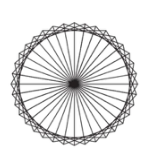

# Tracer un carré avec Python Turtle

## Introduction

Logo est un robot éducatif, initialement créé dans les années 40 et
popularisé par **Seymour Papert**. Il est capable de dessiner sur une
feuille placée en dessous et peut être contrôlé par des instructions
programmatiques simples : avancer, reculer, tourner, etc.

Dans cette activité, nous utilisons une **simulation informatique de la
tortue** réalisée avec le langage **Python** afin de tracer la figure
ci-dessous.



------------------------------------------------------------------------

# 1. Tracer un carré

Pour pouvoir utiliser la tortue Python, il faut importer la bibliothèque
`turtle`.

``` python
from turtle import *
```

La tortue Python est contrôlée par **quatre commandes de base** :

  Action             Commande
  ------------------ --------------------------
  Avancer            `forward()` ou `fd()`
  Reculer            `backward()` ou `back()`
  Tourner à gauche   `left()`
  Tourner à droite   `right()`

Chaque commande prend **un nombre entre parenthèses** qui représente le
paramètre de la fonction.

Exemple :

``` python
forward(100)
```

Le programme suivant contient **trois instructions** :

``` python
forward(100)
right(90)
forward(100)
```

Lors de ses déplacements, la tortue **laisse une trace**, ce qui permet
de dessiner des figures.

### Exercice

Compléter le programme aux **trois instructions** pour tracer **un carré**.


> **Note :** Si l'on exécute le programme depuis un fichier, il faut
> ajouter l'instruction `exitonclick()` à la fin du programme, sinon la
> fenêtre d'affichage disparaît dès que l'exécution est terminée.

------------------------------------------------------------------------

# 2. Utiliser une variable

Pour changer la taille du carré dessiné précédemment, il faudrait
modifier plusieurs fois la valeur `100`.

Une solution plus efficace consiste à **stocker cette valeur dans une
variable** et à utiliser cette variable plusieurs fois.

On donne ici la valeur **50** à la variable `cote`.

Cette opération s'appelle une **affectation** et s'écrit en Python avec
le signe `=`.

``` python
from turtle import *
cote = 50
forward(cote)
right(90)
forward(cote)


exitonclick()
```


### Exercice

Compléter le programme ci-dessous pour dessiner **un carré de côté 50**.

# 3. Utiliser une boucle 

On remarque que ce programme répète quatre fois les mêmes deux
instructions.\
Pour automatiser ce programme, on peut réaliser une boucle à l'aide de
l'instruction `for`.

``` python
cote = 50
for i in range(4):      # exécuter le corps de la boucle 4 fois
    forward(cote)       # première instruction du corps de la boucle
    right(90)           # deuxième instruction du corps de la boucle
print("fini !")
```

Le corps de la boucle (lignes 3 et 4) est un bloc d'instructions qui est délimité par son décalage vers la droite, ou **indentation**.\
La ligne 5 ne fait pas partie de la boucle et est exécutée une seule
fois.\
Le texte qui suit un « croisillon » `#` est appelé un **commentaire**, et n'est pas interprété par Python.

------------------------------------------------------------------------

1.  De manière générale, si l'on veut dessiner un polygone à `n` côtés,     de quel angle faut-il tourner après chaque déplacement ?

2.  Compléter les `??` dans le programme ci-dessous et vérifier qu'il     fonctionne bien avec plusieurs valeurs de `n`.


``` python
n = ??
cote = 50
angle = ??

for i in range(n):
    forward(cote)
    right(angle)
```


# 4.  Définir et utiliser une nouvelle fonction

Pour créer une nouvelle commande de la tortue qui permet de dessiner un
carre, on définit une fonction grâce à l'instruction `def`. Cette
fonction a un paramètre :  la longueur `cote`.

De la même façon que pour une boucle, le bloc d'instructions qui
constitue le corps de la fonction est **indenté**.


``` python
def carre(cote):
    """ Tracer un carre de longueur "cote" """
    # ici vient le corps de la fonction
    # il doit être aligné avec sa description ci-dessus
```

## 1. Compléter la fonction carre(cote)

Compléter le corps de la fonction pour dessiner un carre de côté cote

N’oubliez pas de maintenir **l’indentation**, c’est‑à‑dire le nombre d’espaces au début de chaque ligne.

Une fois la fonction définie, il est possible de l’appeler en indiquant les valeurs de ses paramètres (appelés **arguments**) entre parenthèses :

```python
carre(50)
carre(100)
```

## 2. Compléter la fonction polygone(n,cote)

Créer une nouvelle commande de la tortue qui permet de dessiner un
polygone(n,cote).
Cette fonction a deux paramètres : le nombre de côtés `n`, et leur longueur `cote`. 
Tester cette fonction avec les commandes suivantes :

```python
polygone(6, 100)
polygone(30, 20)
```

## 3. Compléter le programme

Compléter les `??` dans le code ci-dessous pour obtenir la figure présentée dans l’objectif de cette activité.

```python
for i in range(??):
    polygone(3, 100)
    right(??)
```

# 5.  Définir et utiliser une nouvelle fonction

- Ecrire la fonction triangle(c) qui trace un triangle équilatéral de côté c pixel(s) 
- Ecrire la fonction triangle(c,couleur) qui trace un triangle équilatéral de côté c pixel(s) et le dessine de la couleur désirée.
Aide : color('green') change la couleur du prochain tracé. 
- Ecrire une fonction etoile5() qui dessine une étoile à 5 branches


