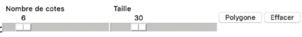

# Contrôler la tortue ...

## OBJECTIFS

Dans l’activité du chapitre 2, nous avons créé une fonction `polygone` qui trace un polygone à l’aide de la bibliothèque `turtle`. Nous allons maintenant créer une interface graphique pour utiliser cette fonction en cliquant simplement sur un bouton.

## 🔘 Des boutons pour lancer des fonctions

Pour commencer, nous créons un bouton pour dessiner un polygone. Nous utilisons la fonction `button` de la bibliothèque [`nsi_ui`](nsi_ui.py), créée spécialement pour ce manuel (ou site). Elle prend pour paramètres le titre du bouton et la fonction Python à appeler lorsqu’on clique dessus.

```python
from turtle import *
from nsi_ui import *
def polygone(n, cote):
""" Tracer un polygone a n cotes de longueur "cote" """ 
    for i in range(n):
        forward(cote) 
        right(360/n)

def creer_polygone():
    """ Fonction sans paramètres que l’on va associer au bouton """
    polygone(5, 60)

button("Polygone", creer_polygone)  # bouton pour faire le dessin
```

QUESTION 1 : Créer un deuxième bouton pour effacer l'écran (fonction `clear` de la [bibliothèque Turtle](https://docs.python.org/fr/3/library/turtle.html))

# 🐢 Des tirettes pour contrôler les paramètres

Pour contrôler la taille du pentagone, on crée une tirette à l’aide de la fonction `slider(...)` de la bibliothèque `nsi_ui`. La fonction `get_int` retourne la valeur de la tirette. On modifie la fonction `creer_polygone` pour utiliser la valeur de la tirette :

```python
# paramètres de slider() : titre du bouton, valeurs min et max
tirette_taille = slider("Taille", 10, 100)
def creer_polygone():
    polygone(5, get_int(tirette_taille))
```

• Créer une seconde tirette pour régler le nombre de côtés du polygone, et modifier la fonction `creer_polygone` en conséquence.

L’interface finale a l’aspect suivant : 

---

# 🐢 Piloter la tortue au clavier

Le code suivant fait avancer la tortue en appuyant sur la flèche vers le haut (`"Up"`). La fonction `onkey` spécifie ce que le programme doit faire lorsqu’il détecte l’appui d’une touche du clavier.

```python
def avance():
    forward(10)

onkey(avance, "Up")  # paramètres : fonction à appeler, nom de la touche
```

• Compléter le programme ci-dessus pour faire tourner la tortue à angles droits avec les flèches droite (`"Right"`) et gauche (`"Left").
