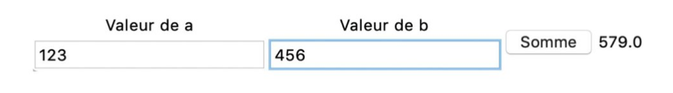
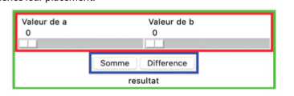

# Interaction textuelle et graphique

## 1. Interaction textuelle

La façon la plus simple d’interagir avec un programme est de lire et d’afficher du texte dans la console. On parle d’interaction « en mode console » ou « en ligne de commande ».

### 1.1. Afficher du texte

Nous avons déjà vu la fonction print pour afficher des valeurs sous forme textuelle. Cette fonction admet autant de paramètres que l’on veut, de n’importe quel type (chaîne de caractères, nombre, etc.). Elle affiche la concaténation de ces paramètres en les « collant » l’un après l’autre, séparés par des espaces :

```python
a = 3
b = 5.4
print("La somme de", a, "et", b, "est égale à", a+b)
```

La somme de 3 et 5.4 est égale à 8.4

Python permet d’utiliser des chaînes de caractères particulières, appelées chaînes de formatage, qui simplifient l’affichage de chaînes complexes faisant intervenir des valeurs de variables et d’expressions. L’affichage ci-dessus peut être produit par :

```python
print(f"La somme de {a} et {b} est égale à {a+b}.")
```

Une chaîne de formatage commence par la lettre f (pour « format ») avant le guillemet ouvrant (simple ou double). La chaîne peut contenir des expressions Python (ici a, b et a+b) entre accolades. Chaque expression est alors remplacée par sa valeur.

### 1.2. Lire du texte

Pour « lire » du texte en Python, on utilise la fonction input() qui met en pause le programme et attend que l’utilisateur saisisse du texte et termine la saisie en appuyant sur la touche Entrée.
Attention : la valeur retournée par input() est toujours une chaîne de caractères, même si ce que l’utilisateur a tapé ressemble à un nombre ! Pour effectuer des opérations arithmétiques, il faut d’abord convertir ces chaînes de caractères en nombre entier (int()) ou en nombre à virgule flottante (float()). Par exemple, un programme qui ajoute deux nombres entrés par l’utilisateur s’écrit ainsi :


```python
# attente que l’utilisateur entre les valeurs de a et b
 a = input("Valeur de a ? ")
 b = input("Valeur de b ? ")
 # convertir a et b en flottants, et calculer la somme
 print("Resultat = ", float(a) + float(b))
```

### 1.3. Gérer les erreurs dans les entrées : l’instruction try

Que se passe-t-il si l’utilisateur tape comme valeur de a une chaîne de caractères qui ne peut pas être interprétée comme un nombre ? Voici le résultat de l’exécution du programme :


Valeur de a ? toto
Valeur de b ? tutu
Traceback (most recent call last):
  File "<stdin>", line 5, in <module>
ValueError: could not convert string to float: 'toto'

La conversion en nombre flottant provoque une erreur d’exécution de type ValueError. Pour éviter que le programme ne s’arrête à cause de cette erreur, il faut l’intercepter grâce à l’instruction Python try.

```python
try:
	a = float(input("Valeur de a ? "))
    print("Resultat = ", a)
except ValueError:
    print("Oups, a n'est pas un nombre.")
```
Si une erreur de type ValueError se produit pendant l’exécution des instructions comprises dans le bloc try, le code du bloc except est exécuté.

Pour rendre le programme plus convivial et redemander à l’utilisateur la saisie si celle-ci est incorrecte, il faut programmer une boucle :

```python
ok = False
while not ok:
	try:
		a = float(input("Valeur de a ? "))
		ok = True
	except ValueError:
    	print("Erreur de saisie ! Entrer une valeur flottante :")
```

---

## 2. Interaction graphique

L’interaction purement textuelle avec input et print est rapidement limitée si l’on veut créer des programmes plus interactifs. L’interaction graphique consiste à afficher des informations sous forme graphique, comme avec la bibliothèque turtle, et à permettre à l’utilisateur d’entrer des données et de lancer des actions à l’aide d’interacteurs. Les interacteurs sont par exemple des boutons, des champs de saisie de texte, ou des « tirettes » (« sliders » en anglais) pour entrer des nombres.

### 2.1. Fonctions de rappel

Il est possible en Python de passer une fonction en paramètre à une autre fonction :
```python

def coucou():
	print("Coucou")

def repete(f):
	f()
	f()

repete(coucou)  # affiche "Coucou" deux fois
```
La plupart des interacteurs sont associés à des fonctions, appelées fonctions de rappel. Par exemple, un bouton est associé à une fonction qu’il appelle lorsque l’on clique dessus :

button("Effacer", clear)  # appelle clear() lorsqu'on clique le bouton

### 2.2. Interacteurs de base

L’exemple suivant calcule la somme de deux nombres.
```python
from nsi_ui import *

    # champs de saisie de texte pour entrer les valeurs de a et b
champA = entry("Valeur de a")
champB = entry("Valeur de b")

def ajouter():
# Afficher la somme des valeurs des champs A et B
	a = get_float(champA)
	b = get_float(champB)
	set_text(resultat, a+b)

button("Somme", ajouter)  # bouton pour lancer le calcul
resultat = label("")      # zone d’affichage du résultat
main_loop()                 # lancer l’interface
```

- La fonction `entry` (lignes 4 et 5) crée un champ de texte avec un titre. Elle retourne une valeur qui peut être passée à la fonction `get_float` (lignes 9 et 10) pour obtenir la valeur entrée par l’utilisateur.

- La fonction `button` (ligne 13) crée un bouton qui permet de déclencher une action lorsque l’on clique dessus. Ici, on associe la fonction `ajouter` au bouton intitulé *Somme*. Celle-ci va chercher les valeurs de `a` et `b` depuis les interacteurs `champA` et `champB` (via `get_float`) et calcule le résultat, qu’elle affiche dans l’interacteur `label` grâce à la fonction `set_text`.

- La fonction `label` (ligne 14) crée une zone non interactive pour afficher un texte. Elle retourne une valeur qui peut être passée à la fonction `set_text` (ligne 11) pour afficher du texte.

L’interface résultante est la suivante :



Contrairement à l’interaction textuelle, cette interface permet d’entrer les valeurs de a et b dans un ordre quelconque et de modifier leurs valeurs. Ce style de program-mation est dit **réactif**: au lieu d’imposer à l’utilisateur un ordre strict, le programme réagit à ses actions. Ainsi, la fonction **ajouter** n’est pas appelée directement par le programme, mais lorsque l’utilisateur clique sur le bouton Somme.

### 2.3. Mise en page d’interfaces : les conteneurs

Pour mieux contrôler leur placement, on utilise des conteneurs permettant de grouper leur contenu horizontalement ou verticalement :
```python
from nsi_ui import *
begin_vertical()    #Début du rectangle vert
begin_horizontal()  #Début du rectangle rouge
champA = slider("Valeur de a", 0, 100)
champB = slider("Valeur de b", 0, 100)
end_horizontal()    #Fin du rectangle rouge
begin_horizontal()  #Début du rectangle bleu
button("Somme", ajouter)
button("Difference", soustraire)
end_horizontal()     #Fin du rectangle bleu
end_vertical()   #Fin du rectangle vert
```




### 2.4. Les écouteurs d’événements

Les interacteurs tels que le bouton ou le champ de saisie de texte réagissent aux actions de l’utilisateur.

On appelle événement toute action de l’utilisateur sur un périphérique d’entrée d’ordinateur : appuyer sur une touche du clavier, la relâcher, déplacer la souris, cliquer un bouton, toucher un écran tactile, etc.

Pour réagir à ces événements, on utilise des fonctions appelées écouteurs d’événements :

    onclick(actionXY)              # clic sur la tortue
    onscreenclick(actionXY)        # clic ailleurs sur l'écran
    ondrag(actionXY)               # glissé sur la tortue
    onkey(action, t)               # appui sur la touche t

Dans l’exemple suivant, l’appui sur la touche 'a' fait avancer la tortue, et cliquer‑tirer la tortue lui fait suivre le curseur de la souris :

    onkey(avance, 'a')  #taper a fait avancer la souris
    ondrag(goto)        # cliquer tirer la tortue lui fait suivre la souris


📥 [Télécharger `cours interaction.py`](cours.py)
