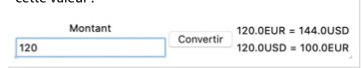
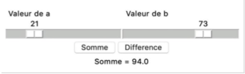
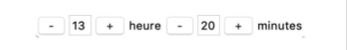

# Exercice PYTHON CH3 : Interaction

### Le pitch

Les programmes informatiques peuvent interagir avec l’utilisateur en récupérant des valeurs saisies au clavier ou en proposant des interfaces graphiques simples.
En Python, cela se fait avec `input()` ou avec des bibliothèques comme `nsi_ui`.

---

## 📝 Exercices

### 🔹 Exercice 1 — Fonction booléenne

Écrire une fonction `input_bool` pour saisir une valeur booléenne.

- La fonction prend un message en paramètre
- Elle retourne :
  - `True` si l’utilisateur tape **oui** ou **o**
  - `False` si l’utilisateur tape **non** ou **n**
- Si l’utilisateur tape autre chose :
  - afficher un message d’erreur
  - redemander jusqu’à obtenir une valeur valide

---

### 🔹 Exercice 2 — Conversion de températures

#### a. Conversion simple

Écrire un programme qui saisit une valeur en degrés centigrades et la convertit en degrés Fahrenheit.

Formule :

```python
degreC = (degreF - 32) * 5/9
```

#### b. Programme amélioré

Modifier le programme pour que l’utilisateur puisse saisir également l’unité (°C ou °F).
Le programme doit alors convertir dans l’autre unité.

#### C. construire une interface graphique pour cet exercice

---

### 🔹 Exercice 3 — Table de multiplication

Écrire un programme qui demande d’entrer un nombre entre 1 et 9 et affiche la table de multiplication de ce nombre.

Exemple :

```
1 x 6 = 6
...
10 x 6 = 60
```

---

### 💡 Indication

On utilisera les chaînes de formatage avec alignement :

```python
f'{x:4}'
```
## 🔹 Exercice 4 — Conversion de monnaies

Écrire un programme avec une interface graphique permettant de convertir entre deux monnaies.

Le programme demandera d’abord à l’utilisateur :
- les noms des deux monnaies
- le taux de change

Puis, il proposera une interface avec :
- un champ de saisie pour le montant
- un bouton "Convertir"
- l’affichage des deux conversions




---

## 🔹 Exercice 5 — Somme et différence

a. Reprendre le programme du cours qui permet d’additionner deux nombres.

Ajouter un bouton permettant de calculer la différence entre les deux nombres.

b. Utiliser des conteneurs pour obtenir une interface organisée :
- deux champs de saisie (valeur de a et valeur de b)
- deux boutons : "Somme" et "Différence"
- affichage du résultat



---

## 🔹 Exercice 6 — Saisie d’une heure

Écrire un programme qui affiche une interface graphique pour saisir une heure complète.




L’interface doit comporter :
- des boutons "+" et "-" pour modifier l’heure et les minutes
- un affichage de l’heure actuelle

Contraintes :
- l’heure doit rester valide (0 à 23)
- les minutes doivent rester entre 0 et 59

Exemple :
- si l’heure est 13 h 59 et que l’on ajoute une minute → 14 h 00

---

## 💡 Remarque

La fonction suivante peut être utile :

```python
set_width(interacteur, largeur)
```

- Pour un champ texte (`entry`) → largeur en nombre de caractères
- Pour les autres éléments → largeur en pixels


