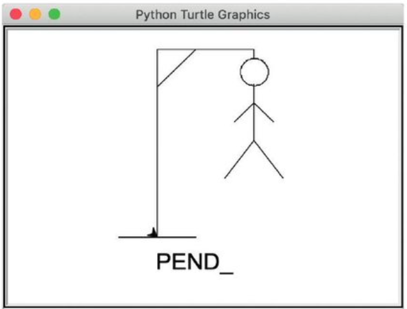
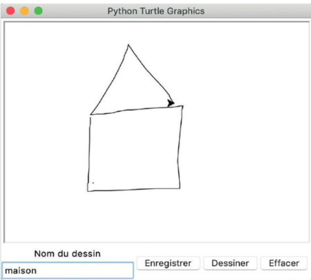

# Exercices NSI — Python

---

## A — Le jeu du pendu

Le jeu du pendu consiste à faire deviner un mot lettre par lettre, avec un nombre limité d'erreurs.

Un tour de jeu se déroule de la façon suivante :

- le joueur propose une lettre ;
- si cette lettre a déjà été jouée, le programme l'indique et lui permet d'en essayer une autre ;
- si cette lettre est dans le mot recherché, le programme l'indique au joueur et affiche le mot à trous. Par exemple, si le mot recherché est « ananas » et le joueur a proposé « n » au premier tour, le programme doit afficher `-n-n--` ;
- sinon, le programme doit indiquer au joueur que cette lettre n'est pas dans le mot recherché, afficher les lettres déjà essayées, et indiquer le nombre de coups restants.

### 1. Proposer une lettre

Écrire la fonction `demander_lettre` qui demande une lettre à l'utilisateur. Si l'entrée de l'utilisateur n'est pas un unique caractère, la fonction lui rappelle qu'elle n'a besoin que d'une lettre et demande à nouveau, jusqu'à ce qu'un unique caractère soit entré. Elle retourne ensuite cette lettre.

**Bonus :** à l'aide du mot-clé `in`, contraindre le joueur à n'entrer que des lettres, des apostrophes ou des tirets.

### 2. Mot à trou

Écrire une fonction `remplace(reference, actuel, lettre)` qui prend en paramètre trois chaînes de caractères : un mot de référence, un mot « actuel » composé d'autant de caractères que `reference`, et une lettre. Si `reference` contient `lettre` au moins une fois, la fonction doit modifier `actuel` en remplaçant ses caractères par `lettre` aux emplacements correspondants, et retourner cette version modifiée ; par exemple, `remplace("boom", "b---", "o")` retourne `"boo-"`. Sinon, la fonction retourne `None`.

`None` est une valeur spéciale qui est différente de toutes les valeurs de tous les autres types. Elle représente une valeur absente ou inconnue. On peut comparer une valeur à `None` avec les opérateurs `is` et `is not`.

> **Note :** Attention, on ne peut pas directement modifier un caractère dans une chaîne. On peut cependant construire la nouvelle version de `actuel` à partir d'une chaîne vide en parcourant et ajoutant les caractères un à un. Une autre solution consiste à transformer une chaîne `ch` en tableau à l'aide de `t = list(ch)`, modifier des éléments spécifiques du tableau `t`, et obtenir à nouveau une chaîne à l'aide de `"".join(t)`.

### 3. Structure du programme

Écrire la fonction principale `pendu(mot, nb_erreurs)` qui fait deviner à l'utilisateur le `mot` en faisant moins de `nb_erreurs` erreurs, en utilisant `demander_lettre` et `remplace`.

On pensera à créer et maintenir :

- une liste `lettres_jouees` qui contient les lettres déjà proposées ;
- une variable `mot_actuel` (chaîne) qui contient le mot en train d'être deviné. Elle doit être initialisée avec autant de fois le caractère `-` qu'il y a de lettres dans `mot`, et mise à jour à chaque fois que le joueur devine une lettre.

Ne pas oublier que le joueur a droit à `nb_erreurs` erreurs avant de perdre. La partie continue donc tant que le joueur n'a pas fait autant d'erreurs, ou que `mot` n'a pas été entièrement deviné.

### 4. Bonus — Dessiner le pendu

À l'aide de la bibliothèque `turtle`, dessiner progressivement le pendu à chaque erreur.



---

## B — Dessiner avec la tortue

Pour représenter un dessin, on utilise un tableau contenant une suite de positions de la tortue, chaque position est représentée par un tuple contenant ses coordonnées `x, y`.

### 1. Afficher un dessin

**a.** Écrire une fonction `dessine` qui prend un tel tableau en paramètre, par exemple le tableau `maison` ci-dessous, et dessine son contenu à l'aide de la fonction `goto(x, y)` de la bibliothèque `turtle`.

```python
maison = [(0,0), (0,100), (50,150), (100,100), (100,0), (0,0)]
```

**b.** Créer au moins deux autres tableaux de points qui représentent des dessins de votre choix, en commençant toujours aux coordonnées `(0, 0)`.

**c.** Les fonctions `xcor()` et `ycor()` de la bibliothèque `turtle` retournent la position `x` et `y` de la tortue. Modifier la fonction `dessine` afin qu'elle trace le dessin à partir de la position de la souris. Pour cela, il faut additionner les coordonnées initiales de la tortue aux coordonnées de chaque point du dessin.

### 2. Enregistrer un dessin à main levée

Au lieu de créer les dessins comme ci-dessus, on va enregistrer le dessin réalisé en déplaçant la tortue.

**a.** Compléter le programme suivant pour que l'on puisse dessiner en cliquant sur la tortue et en la déplaçant :

```python
from turtle import *

def sauter(x, y):
    """ Déplace la tortue sans dessiner à la position x, y """
    ...

onscreenclick(sauter)  # bouger la tortue lorsqu'on clique dans la fenêtre

def tracer(x, y):
    """ Dessine un trait jusqu'à la position x, y """
    ...

ondrag(tracer)  # dessiner lorsqu'on déplace la tortue avec la souris
```

**b.** Enregistrer les points dans une variable globale `dessin` au fur et à mesure du tracé : initialiser cette liste (`[]`) lorsque l'on commence à dessiner, en définissant une fonction de rappel pour l'événement `onclick`. Ensuite, ajouter les points du dessin à ce tableau dans la fonction `tracer` grâce à la méthode `dessin.append(p)`.

**c.** Ajouter enfin un bouton pour effacer l'écran et un bouton pour dessiner le dessin enregistré.

### 3. Enregistrer et rappeler des dessins nommés

On veut maintenant pouvoir enregistrer plusieurs trajectoires et leur donner un nom afin de les rappeler plus tard. Pour cela, on utilise un dictionnaire qui associe un nom à un tableau de points.

```python
dessins = {
    "maison": [(0,0), (0,100), ...],
    "voiture": [...],
    ...
}
```

Compléter le programme pour créer l'interface ci-contre. Le champ de saisie permet d'entrer le nom d'un dessin. Le bouton *Enregistrer* ajoute le dessin courant au dictionnaire avec ce nom. Le bouton *Dessiner* redessine le dessin portant ce nom, s'il existe.


