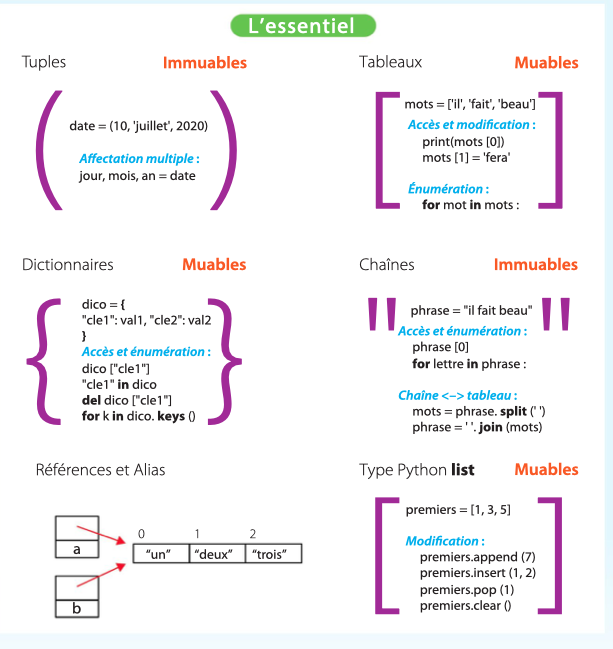

# Types simples et types structurés

## 1. Types simples et types structurés

Tous les langages de programmation de haut niveau permettent de composer les types de base (nombres, chaînes de caractères, booléens) afin de créer des types plus complexes permettant de représenter des *collections* de valeurs. On appelle ces types des types construits ou types structurés.

Ces types permettent de *construire* une collection à partir de ses éléments, de l'*affecter* à une variable, de la *passer en paramètre* à une fonction, de la *retourner* comme valeur d'une fonction, d'*extraire* ses éléments ou de *modifier* son contenu.

Ce chapitre introduit trois types structurés de Python : les tuples, les tableaux (aussi appelés listes en Python) et les dictionnaires. Il revient également sur les chaînes de caractères, introduites au chapitre 2 comme un type de base, mais qui sont en réalité un type construit.

---

## 2. Les tuples

Un tuple est constitué d'une collection ordonnée d'éléments. Il correspond à un p-uplet en mathématiques. Un tuple avec deux éléments est une *paire*, avec trois éléments un *triplet*, etc. Les tuples sont notés entre parenthèses en listant les éléments séparés par des virgules :

- si `x` et `y` sont deux nombres, le tuple `(x, y)` peut représenter un point ;
- le tuple `(10, 'juillet', 2020)` peut représenter une date ;
- le tuple `(7, 'pique')` peut représenter une carte à jouer ;
- si `p` et `q` sont des entiers, `(p, q)` peut représenter le nombre rationnel p/q.

Un tuple peut être affecté à une variable et une fonction peut retourner un tuple :

```python
position = (100, 200)
date = (10, 'juillet', 2020)
carte = (7, 'pique')
fraction = (10, 7)

def position():
    """ Retourne un tuple contenant la position (x, y) de la tortue """
    return (xcor(), ycor())
```

!!! note
    Le tuple vide est noté `()`. Un tuple avec un seul élément doit avoir une virgule après l'élément pour le distinguer d'une simple expression entre parenthèses : `(10,)` et non pas `(10)` qui est simplement l'entier 10.

Pour extraire les éléments d'un tuple, on utilise l'affectation multiple :

```python
x, y = position          # x vaut 100 et y vaut 200
jour, mois, année = date # jour = 10, mois = 'juillet', année = 2020
valeur, couleur = carte  # valeur = 7, couleur = 'pique'
p, q = fraction          # p = 10, q = 7
```

!!! note
    L'affectation multiple permet d'échanger les valeurs de deux variables : `a, b = (b, a)`. Les parenthèses sont optionnelles et on peut écrire : `a, b = b, a`.

Le nombre de variables à gauche de l'affectation doit correspondre au nombre d'éléments du tuple, sinon une erreur se produit :

```python
>>> x, y = (1, 2, 3)
Traceback (most recent call last):
  File "<stdin>", line 1, in <module>
ValueError: too many values to unpack (expected 2)
```

Une fonction peut prendre un tuple en paramètre :

```python
def norme(p):
    """ calcule la norme du point p """
    x, y = p
    return math.sqrt(x*x + y*y)
```

!!! note
    On peut utiliser le nom de variable `_` pour « sauter » des éléments : `x, _, y = (1, 2, 3)`.

Une fonction peut également retourner un tuple comme élément. L'affectation multiple peut alors récupérer ce tuple, ou bien ses éléments :

```python
personne = ("Lovelace", "Ada", (10, 'decembre', 1815), 'Londres')
nom, prenom, date, lieu = personne  # date vaut (10, 'decembre', 1815)
# ou bien :
nom, prenom, (jour, mois, an), lieu = personne
```

Un tuple est immuable : une fois construit, on ne peut pas modifier son contenu. En particulier, si on construit un tuple avec des variables, ce sont les *valeurs* de ces variables qui sont utilisées, et le tuple ne sera pas modifié si on change les valeurs de ces variables :

```python
a = 10
b = 20
t = (a, b)  # t vaut (10, 20)
a = 50      # t vaut toujours (10, 20)
```

Ex 02-15-16

---

## 3. Les tableaux

Un tableau est une collection ordonnée d'éléments de *même* type. Contrairement aux tuples, les tableaux sont muables, c'est-à-dire que le contenu d'un tableau peut changer après sa création. Un tableau peut servir par exemple à représenter une suite de nombres, ou la suite des mots d'un texte.

Un tableau est noté entre crochets. L'accès aux éléments d'un tableau se fait par la notation indexée `t[i]`, où `i` est appelé l'indice de l'élément `t[i]`. Le premier élément du tableau est à l'indice 0, le nombre d'éléments d'un tableau est donné par `len(t)` :

```python
premiers = [1, 2, 3, 5, 7, 11, 13, 17, 19, 23]
print('le cinquième nombre premier est', premiers[4])  # 1er indice = 0
for i in range(len(premiers)):  # i va de 0 à len(premiers)-1
    print('indice', i, '->', premiers[i])
```

!!! note
    Les termes « mutable » et « immutable », issus de l'anglais, sont souvent utilisés au lieu de « muable » et « immuable ».

Si l'on tente d'accéder à un élément avec un indice en dehors du tableau, on obtient une erreur :

```python
>>> premiers[20]
Traceback (most recent call last):
  File "<stdin>", line 1, in <module>
IndexError: list index out of range
```

On peut énumérer les éléments d'un tableau comme indiqué ci-dessus, avec un indice qui va de 0 à sa longueur (`for i in range(len(t))`). Si l'on n'a pas besoin de la valeur de l'indice, on peut aussi énumérer les éléments directement avec l'instruction `for e in t`. Dans ce cas, la variable de boucle prend les valeurs des éléments du tableau :

```python
for n in premiers:  # n vaut les éléments successifs du tableau
    print(n, 'est un nombre premier')
```

!!! note
    On peut également utiliser la notation indexée, l'énumération, la concaténation et la répétition avec les tuples.

Comme pour les chaînes de caractères, on peut créer de nouveaux tableaux à partir de tableaux existants par concaténation (opérateur `+`) et par répétition (opérateur `*`) :

```python
pairs = [2, 4, 6, 8, 10]
impairs = [1, 3, 5, 7, 9]
nombres = pairs + impairs       # = [2, 4, 6, 8, 10, 1, 3, 5, 7, 9]
couleurs = ['trefle', 'pique'] + ['coeur', 'carreau']
zeros = [0] * 100               # tableau de 100 éléments, qui valent tous 0
cycle = [1, 2, 3] * 10          # 10 fois la séquence 1, 2, 3
```

Contrairement aux tuples, les tableaux sont des types muables : on peut modifier leur contenu. Pour modifier un élément de tableau, on utilise la notation indexée à gauche d'une affectation :

```python
t = [1, 2, 3]
for i in range(len(t)):
    t[i] = t[i] * 2  # doubler la valeur du i-ème élément
# t vaut [2, 4, 6]
```

!!! note
    Un tableau vide est noté `[]`.

Les éléments d'un tableau doivent être d'un même type, même si Python n'impose pas cette contrainte. Ce type peut être un type de base, comme dans les exemples ci-dessus, mais aussi un type construit, comme un tuple ou un tableau, ce qui permet de représenter des données complexes.

Par exemple, un tableau peut contenir un ensemble de coordonnées `(x, y)`, ou l'ensemble des cartes d'un jeu de carte, ou une main d'un joueur. Inversement, un tuple peut contenir un tableau comme élément. Par exemple on peut représenter le joueur d'un jeu de cartes par un tuple constitué de son nom, du tableau de ses cartes, et de son score :

```python
# tableau de tuples
cartes = [("as", "pique"), (10, "trefle"), ("valet", "trefle"),
          (10, "coeur"), (5, "pique")]
# tuple avec le tableau 'cartes' comme second élément
joueur = ("Joe", cartes, 120)
```


### 3.1. Remarque : les listes

Dans le langage Python, les tableaux sont mis en œuvre par un type construit plus général appelé *list*. Ce type permet d'ajouter et de retirer des éléments d'une liste, alors que dans beaucoup de langages de programmation la taille d'un tableau est fixée à sa création.

Pour ajouter et retirer des éléments d'une liste, on utilise des méthodes. Une méthode est une fonction associée à un type d'objet. On l'appelle en utilisant la notation pointée `objet.methode(parametres)`. Les méthodes sont utilisées en particulier avec les types muables pour les fonctions qui modifient la valeur de l'objet. Les méthodes qui permettent de modifier le contenu d'une liste sont les suivantes :

```python
premiers.append(13)    # ajoute le nombre 13 à la fin de la liste
mots.insert(1, "et")   # insère "et" en 2e position (on démarre à 0)
p = points.pop(2)      # retire l'élément à l'indice 2 et retourne sa valeur
points.clear()         # retire tous les éléments de la liste
```

Dans ce manuel, on emploie le mot *liste* lorsqu'il s'agit d'une séquence d'éléments à laquelle on va ajouter et retirer des éléments, et le mot *tableau* lorsqu'il s'agit d'une séquence d'éléments de taille fixe, dont le contenu, mais pas la taille, peut changer.

Ex 06-18-20

---

## 4. Les chaînes de caractères

Les chaînes de caractères ont été introduites au chapitre 2 comme un type de base. Elles ont cependant certaines caractéristiques des tableaux :

- on peut obtenir la longueur d'une chaîne `ch` par la fonction Python `len(ch)` ;
- on peut accéder aux caractères de la chaîne avec la notation indexée `ch[i]`.

Cependant les chaînes sont immuables : on ne peut pas modifier leur contenu. L'affectation `ch[i] = "X"` provoque une erreur.

On peut énumérer les caractères d'une chaîne par `for car in ch`.

On peut créer un tableau à partir d'une chaîne de caractères `chaine` en « découpant » celle-ci avec la méthode `chaine.split(separateur)`, qui prend en argument une autre chaîne de caractères `separateur` et retourne un tableau contenant les éléments de `chaine` initialement séparés par `separateur`. À l'inverse, la méthode `join` crée une chaîne de caractères en « collant » ensemble les éléments d'un tableau de chaînes avec un séparateur :

```python
phrase = "Il fait beau"
mots = phrase.split(' ')  # ['Il', 'fait', 'beau']
mots[1] = 'fera'          # ['Il', 'fera', 'beau']
phrase = ' '.join(mots)   # "Il fera beau"
```

!!! note
    « split » en anglais peut signifier « séparer » ou « scinder ».

Ex 08-24-25

---

## 5. Les dictionnaires

Un dictionnaire est une table associative qui fait correspondre des clés à des valeurs de type quelconque. Les clés doivent être d'un type immuable, donc soit des nombres, soit des chaînes de caractères, soit des tuples à condition que ceux-ci ne contiennent que des éléments eux-mêmes immuables. Dans la majorité des cas, les clés sont des chaînes de caractères, ce qui explique le nom de *dictionnaire*, qui associe à chaque mot sa définition.

Un dictionnaire est noté entre accolades `{ ... }`. Chaque entrée est notée par sa clé, suivi de `:`, suivi de sa valeur :

```python
# Un dictionnaire au sens usuel du terme
langages = {
    "Python": "Langage très populaire au début du 21e siècle",
    "Javascript": "Langage popularisé par l'avènement du Web",
    ...
}
# Ici les clés sont des noms et les valeurs des tableaux de coordonnées
dessins = {
    "maison": [(0, 80), (40, 120), (80, 80), (80, 0), (0, 0), (0, 80)],
    "voiture": [(0, 0), (2, 9), (20, 11), ...],
}
# Ici les clés sont des tuples (nom, prénom) et les valeurs sont
# des tuples (date et lieu de naissance)
personnes = {
    ("Lovelace", "Ada"): (10, 'decembre', 1815, 'Londres'),
    ("von Neumann", "John"): (28, 'decembre', 1903, 'Budapest'),
    ("Turing", "Alan"): (23, 'juin', 1912, 'Londres'),
    ...
}
```

!!! note
    Un dictionnaire vide est noté `{}`.

L'accès à une entrée d'un dictionnaire utilise la notation indexée, comme pour les tableaux, mais ici l'indice doit être la clé :

```python
langage["Python"]
dessins["voiture"]
personnes[("Lovelace", "Ada")]
```

Si l'entrée n'existe pas, on obtient une erreur :

```python
>>> langages["Ada"]
Traceback (most recent call last):
  File "<stdin>", line 1, in <module>
KeyError: 'Ada'
```

On peut tester la présence ou l'absence d'une clé avec l'opérateur `in` :

```python
if "maison" in dessins:
    dessiner(dessins["maison"])
if "Python" not in langages:
    print("Il manque Python !")
```

On peut énumérer les clés d'un dictionnaire de la même façon qu'un tableau :

```python
for l in langages:  # l vaut successivement les clés du dictionnaire
    print(l, ':', langages[l])
```

Les dictionnaires sont des types muables : on peut ajouter des entrées, changer leur valeur, et les retirer :

```python
# ajout d'une entrée
langages["Ada"] = "Langage nommé en hommage à Ada Lovelace"
# modification d'une entrée existante
langages["Python"] = "Langage populaire pour l'enseignement"
# retrait d'une entrée, `del` est une instruction : pas de parenthèses
del langages["Javascript"]
```

Enfin, on peut récupérer le contenu d'un dictionnaire avec les méthodes `keys` (clés), `values` (valeurs) et `items` (paires clés/valeurs) :

```python
dico = {"a": 10, "b": 20, "c": 30}
cles = dico.keys()    # retourne la liste ["a", "b", "c"]
valeurs = dico.values() # retourne la liste [10, 20, 30]
items = dico.items()  # retourne la liste de tuples [("a", 10), ...]
# ces listes peuvent être énumérées avec 'for ... in:'
# Exemple : affichage des éléments d'un dictionnaire :
for cle, valeur in dico.items():
    print(cle + ": " + valeur)
```

Ex 14-26-28

---

## 6. Valeurs et références

Lorsque l'on affecte une valeur d'un type construit à une variable, on affecte en réalité une référence à cette valeur. Lorsque l'on affecte cette variable à une autre variable, les deux référencent alors la *même* valeur. On dit que les deux variables sont un alias pour la même valeur. Les alias peuvent être source de confusion et d'erreurs lorsqu'ils référencent des valeurs muables, car la modification du contenu de cette valeur par une variable affecte la valeur de l'autre variable.

Dans l'exemple suivant, après la ligne 2, les variables `a` et `b` référencent le même tableau. Lorsque l'on change la valeur de l'élément `a[1]` (ligne 3), on constate que la valeur référencée par `b` a également changé (ligne 4) :

```python
a = ["x", "y", "z"]
b = a
a[1] = "w"
print(b)  # ['x', 'w', 'z']
```

Si l'on veut que `b` désigne une *copie* de `a`, on peut utiliser la méthode `copy()` des tableaux (qui est aussi disponible pour les dictionnaires) :

```python
a = ["x", "y", "z"]
b = a.copy()  # copier le tableau a
a[1] = "w"
print(b)  # ['x', 'y', 'z']
```

Il faut prendre particulièrement garde aux alias lorsque l'on passe une valeur d'un type construit en paramètre à une fonction, car le paramètre, qui est une variable locale de la fonction, devient un alias pour la variable passée en argument. Dans l'exemple suivant, le tableau `impairs` est, probablement involontairement, modifié par la fonction `tdouble` :

```python
# passage d'un tableau en paramètre
def tdouble(t):
    """ retourne un tableau dont les éléments sont le double de t """
    for i in range(len(t)):
        t[i] = t[i] * 2
    return t

impairs = [1, 3, 5, 7, 9]
doubles = tdouble(impairs)
print(doubles)   # [2, 6, 10, 14, 18]
print(impairs)   # [2, 6, 10, 14, 18]
# doubles et impairs sont le MÊME tableau
```

Pour éviter ces problèmes, il faut clairement documenter la fonction pour indiquer si elle modifie ou non ses paramètres. Dans cet exemple, la documentation de la fonction `tdouble` devrait plutôt être libellée *"remplace les éléments de t par le double de leur valeur"*. Mais si l'intention est bien de retourner un nouveau tableau, il faut par exemple effectuer une copie du paramètre avant la boucle en ajoutant la ligne suivante avant la ligne 4 :

```python
t = t.copy()  # copier le tableau pour ne pas modifier l'original
```

### 6.1. Égalité de valeurs ou de références : l'opérateur `is`

L'opérateur `==` teste l'égalité des *valeurs*, c'est-à-dire pour un type construit l'égalité des contenus. Python permet également de tester l'égalité des *références* avec l'opérateur `is`, et ainsi de savoir si deux références sont des alias de la même valeur :

```python
a = [1, 2]
print(a == [1,2], a is [1,2])  # True, False
b = a
print(a == b, a is b)          # True, True
b = a.copy()
print(a == b, a is b)          # True, False
```

Ex 21-22

## Résumé
# L'essentiel — Types et structures - 



